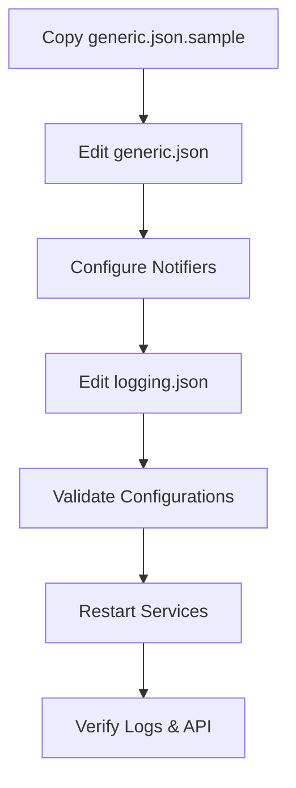

# Configuration

This guide explains how to configure the `analyzer-d4-passivedns` server, a FastAPI-based Passive DNS server compliant with the [Passive DNS - Common Output Format (draft-dulaunoy-dnsop-passive-dns-cof)](https://tools.ietf.org/html/draft-dulaunoy-dnsop-passive-dns-cof). Configuration is primarily managed through `config/generic.json`, with additional settings in `config/logging.json` and notifier-specific `config.json` files.

## Overview

The server supports dynamic configuration for:

- **Database**: Redis or KV Rocks backend.
- **Ingestors**: Data sources (e.g., COF websockets, D4 servers).
- **Notifiers**: Alert mechanisms (e.g., log, mail, webhook).
- **Authentication**: Bearer token-based access control.
- **Rate Limiting**: Per-endpoint request limits.
- **Record Filtering**: Supported record types and exclusions.

## Main Configuration File: `generic.json`

The `generic.json` file in `config/` is the primary configuration file. Copy the sample to start:

```bash
cp config/generic.json.sample config/generic.json
```

Validate configurations:

```bash
python tools/validate_config_files.py --check
```

Update missing fields:

```bash
python tools/validate_config_files.py --update
```

### Example `generic.json`

```json
{
  "database": {
    "type": "redis",
    "config": {
      "host": "localhost",
      "port": 6379,
      "db": 0
    }
  },
  "rrset_supported": ["A", "AAAA", "CNAME"],
  "excludesubstrings": [],
  "expiration": {
    "A": 86400,
    "AAAA": 86400,
    "CNAME": 86400
  },
  "ingestors": {
    "cof_ingestor": {
      "type": "cof",
      "config": {
        "websocket": "ws://crh.circl.lu:8888",
        "frequency": "realtime"
      }
    }
  },
  "notifiers": {
    "log_alert": {
      "type": "log",
      "config": {
        "name": "log_alert",
        "condition": {"rrtype": "A"},
        "level": "info"
      }
    }
  },
  "auth": {
    "endpoints": {
      "query": {"auth": "bearer"},
      "fquery": {"auth": "bearer"},
      "stream": {"auth": "bearer"}
    },
    "tokens": {
      "user": "xyz123"
    }
  },
  "rate_limit": {
    "query": {"requests": 100, "window": 60},
    "fquery": {"requests": 50, "window": 60},
    "stream": {"requests": 10, "window": 60}
  }
}
```

### Key Sections

1. **Database**:
   - `type`: `redis` or `kvrocks`.
   - `config`: Connection details (e.g., `host`, `port`, `db`).
   - Example for KV Rocks:
     ```json
     {
       "database": {
         "type": "kvrocks",
         "config": {
           "host": "localhost",
           "port": 6666
         }
       }
     }
     ```

2. **Record Filtering**:
   - `rrset_supported`: List of supported DNS record types (e.g., `["A", "AAAA"]`).
   - `excludesubstrings`: List of domain substrings to exclude (e.g., `["internal.com"]`).
   - `expiration`: TTL (in seconds) for each record type.

3. **Ingestors**:
   - Keyed by ingestor name, with `type` and `config`.
   - Example for D4:
     ```json
     {
       "ingestors": {
         "d4_ingestor": {
           "type": "d4",
           "config": {
             "server": "127.0.0.1:6380",
             "uuid": "6072e072-bfaa-4395-9bb1-cdb3b470d715",
             "frequency": "daily"
           }
         }
       }
     }
     ```

4. **Notifiers**:
   - Configured in `generic.json` for `log` notifier or in `pdns/notifiers/<name>/config.json` for others.
   - Example for `log`:
     ```json
     {
       "notifiers": {
         "log_alert": {
           "type": "log",
           "config": {
             "name": "log_alert",
             "condition": {"rrtype": "A"},
             "level": "info"
           }
         }
       }
     }
     ```

5. **Authentication**:
   - `endpoints`: Specifies auth type (`bearer` or `none`) per endpoint.
   - `tokens`: Key-value pairs of user IDs and tokens.
   - Example:
     ```json
     {
       "auth": {
         "endpoints": {
           "info": {"auth": "none"}
         },
         "tokens": {
           "admin": "xyz123"
         }
       }
     }
     ```

6. **Rate Limiting**:
   - Configures requests per time window (seconds) per endpoint.
   - Example:
     ```json
     {
       "rate_limit": {
         "query": {"requests": 100, "window": 60}
       }
     }
     ```

## Notifier-Specific Configuration

Notifiers like `mail`, `webhook`, `mattermost`, `rocketchat`, and `matrix` use `pdns/notifiers/<name>/config.json`.

- **Example: `pdns/notifiers/mail/config.json`**:
  ```json
  {
    "name": "mail_alert",
    "condition": {"rrtype": "A"},
    "smtp_host": "smtp.example.com",
    "smtp_port": 587,
    "sender": "alerts@example.com",
    "recipient": "admin@example.com"
  }
  ```

- **Conditions**:
  - Exact match: `{"rrname": "example.com"}`.
  - Regex: `{"rdata": "regex:192\\.168\\..*"}`.
  - IP network: `{"rdata": "in:10.0.0.0/24"}`.

## Logging Configuration: `logging.json`

Configure logging in `config/logging.json`.

- **Example**:
  ```json
  {
    "level": "INFO",
    "file": "pdns.log",
    "format": "%(asctime)s %(levelname)s: %(message)s"
  }
  ```

- **Fields**:
  - `level`: `DEBUG`, `INFO`, `WARNING`, `ERROR`, `CRITICAL`.
  - `file`: Log file path.
  - `format`: Log message format.

## Applying Configuration Changes

1. **Validate**:
   ```bash
   python tools/validate_config_files.py --check
   ```

2. **Restart Services**:
   - FastAPI server:
     ```bash
     sudo systemctl restart pdns.service
     ```
     Or manually:
     ```bash
     poetry run uvicorn pdns.main:app --host 0.0.0.0 --port 8000
     ```
   - Ingestors:
     ```bash
     sudo systemctl restart pdns-cof.service
     ```

3. **Verify**:
   - Check logs:
     ```bash
     tail -f pdns.log
     ```
   - Test API:
     ```bash
     curl -H "Authorization: Bearer xyz123" http://localhost:8000/info
     ```

## Best Practices

- **Secure Configurations**:
  ```bash
  chmod 600 config/generic.json
  chmod 600 pdns/notifiers/*/config.json
  ```
- **Validate Regularly**:
  Run validation before deploying changes:
  ```bash
  python tools/validate_config_files.py --check
  ```
- **Backup Configurations**:
  Back up `config/` before modifications.
- **Minimal Logging in Production**:
  Set `logging.json` to `INFO` or higher:
  ```json
  {
    "level": "INFO"
  }
  ```
- **Test Authentication**:
  Verify tokens work:
  ```bash
  curl -H "Authorization: Bearer xyz123" http://localhost:8000/query/example.com
  ```

## Mermaid Diagram: Configuration Workflow



For related guides, see:

- [Installation](./installation.md)
- [Server Management](./management.md)
- [Ingestors](./ingestors.md)
- [Notifiers](./notifiers.md)
- [Troubleshooting](./troubleshooting.md)