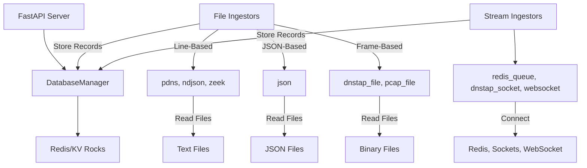

# Ingestors

This guide describes the ingestors available in the `analyzer-d4-passivedns` project, a FastAPI-based Passive DNS server compliant with the [Passive DNS - Common Output Format (draft-dulaunoy-dnsop-passive-dns-cof)](https://tools.ietf.org/html/draft-dulaunoy-dnsop-passive-dns-cof). Ingestors collect DNS data from various sources (e.g., files, streams) and store it in the database (e.g., Redis, KV Rocks) using the `DatabaseManager`.

## Overview

Ingestors are modular, dynamically loaded from `config/generic.json`, and organized into two main categories: **File Ingestors** (processing static files) and **Stream Ingestors** (processing continuous data streams). Each ingestor is a subclass of `Ingestor`, with specialized base classes (`FileIngestor`, `LineIngestor`, `FrameIngestor`, `StreamIngestor`) defined in `pdns/ingestors/base.py`. Ingestors typically run as separate processes via scripts in `bin/`.

### File Ingestors
- **Line-Based**: Process text files line-by-line (e.g., `pdns`, `ndjson`, `zeek`).
- **JSON-Based**: Process JSON arrays (e.g., `json`).
- **Frame-Based**: Process binary framed data (e.g., `dnstap_file`, `pcap_file`).

### Stream Ingestors
- Process real-time data streams (e.g., `redis_queue`, `dnstap_socket`, `websocket`).

## Available Ingestors

### File Ingestors

#### `pdns` (PassiveDNS-Formatted Files)
- **Description**: Ingests line-based files formatted in the PassiveDNS format, where each line contains fields like timestamp, query name, and response data.
- **Config**:
  - `file_path` (string, required): Path to the PassiveDNS file.
- **Example**:
  ```json
  {
    "ingestors": {
      "pdns_ingestor": {
        "type": "pdns",
        "config": {
          "file_path": "/path/to/pdns.log"
        }
      }
    }
  }
  ```

#### `ndjson` (Newline-Delimited JSON Files)
- **Description**: Ingests NDJSON files where each line is a JSON object representing a DNS record.
- **Config**:
  - `file_path` (string, required): Path to the NDJSON file.
- **Example**:
  ```json
  {
    "ingestors": {
      "ndjson_ingestor": {
        "type": "ndjson",
        "config": {
          "file_path": "/path/to/dns.ndjson"
        }
      }
    }
  }
  ```

#### `zeek` (Zeek DNS Log Files)
- **Description**: Ingests Zeek DNS log files, where each line is a JSON object containing DNS query details.
- **Config**:
  - `file_path` (string, required): Path to the Zeek log file.
- **Example**:
  ```json
  {
    "ingestors": {
      "zeek_ingestor": {
        "type": "zeek",
        "config": {
          "file_path": "/path/to/zeek_dns.log"
        }
      }
    }
  }
  ```

#### `json` (JSON Array Files)
- **Description**: Ingests JSON files containing an array of DNS record objects.
- **Config**:
  - `file_path` (string, required): Path to the JSON file.
- **Example**:
  ```json
  {
    "ingestors": {
      "json_ingestor": {
        "type": "json",
        "config": {
          "file_path": "/path/to/dns.json"
        }
      }
    }
  }
  ```

#### `dnstap_file` (DNSTap Framed Files)
- **Description**: Ingests DNSTap files containing framed binary DNS data, parsed into `PDNSRecord` objects.
- **Config**:
  - `file_path` (string, required): Path to the DNSTap file.
- **Example**:
  ```json
  {
    "ingestors": {
      "dnstap_ingestor": {
        "type": "file_dnstap",
        "config": {
          "file_path": "/path/to/dnstap.bin"
        }
      }
    }
  }
  ```

#### `pcap_file` (PCAP Files)
- **Description**: Ingests PCAP files containing DNS packets, parsed using Scapy or an optional `passivedns` binary.
- **Config**:
  - `file_path` (string, required): Path to the PCAP file.
  - `passivedns` (string, optional): Path to the `passivedns` binary for parsing.
- **Example**:
  ```json
  {
    "ingestors": {
      "pcap_ingestor": {
        "type": "file_pcap",
        "config": {
          "file_path": "/path/to/dns.pcap",
          "passivedns": "/usr/bin/passivedns"
        }
      }
    }
  }
  ```

### Stream Ingestors

#### `redis_queue` (Redis Queue)
- **Description**: Ingests DNS records from a Redis queue, parsing each message as a PassiveDNS-formatted line.
- **Config**:
  - `redis_uri` (string, required): Redis connection URI (e.g., `redis://localhost:6379/queue_name`, `host:port:queue`, or `socket:queue`).
- **Example**:
  ```json
  {
    "ingestors": {
      "redis_ingestor": {
        "type": "d4redis",
        "config": {
          "redis_uri": "redis://localhost:6379/dns_queue"
        }
      }
    }
  }
  ```

#### `dnstap_socket` (DNSTap Socket)
- **Description**: Ingests live DNSTap streams over Unix socket or TCP, processing framed DNS messages.
- **Config**:
  - `connection_type` (string, required): `unix` or `tcp`.
  - `address` (string, required): Socket path (for `unix`) or IP/host (for `tcp`).
  - `port` (integer, optional): TCP port (required for `tcp`).
- **Example**:
  ```json
  {
    "ingestors": {
      "dnstap_socket_ingestor": {
        "type": "stream_dnstap",
        "config": {
          "connection_type": "tcp",
          "address": "127.0.0.1",
          "port": 6000
        }
      }
    }
  }
  ```

#### `websocket` (WebSocket)
- **Description**: Ingests real-time DNS records from a WebSocket connection, processing JSON messages.
- **Config**:
  - `ws_url` (string, required): WebSocket URL (e.g., `ws://example.com/dns`).
- **Example**:
  ```json
  {
    "ingestors": {
      "websocket_ingestor": {
        "type": "websocket",
        "config": {
          "ws_url": "ws://example.com/dns"
        }
      }
    }
  }
  ```

## Configuration

Ingestors are configured in `config/generic.json` under the `ingestors` key. Each ingestor requires:
- `type`: Matches the ingestor’s type (e.g., `pdns`, `file_dnstap`).
- `config`: Source-specific settings (e.g., `file_path`, `redis_uri`).

Validate configurations with:

```bash
python tools/validate_config_files.py --check
```

### Example `generic.json` with Multiple Ingestors

```json
{
  "ingestors": {
    "pdns_ingestor": {
      "type": "pdns",
      "config": {
        "file_path": "/path/to/pdns.log"
      }
    },
    "redis_ingestor": {
      "type": "d4redis",
      "config": {
        "redis_uri": "redis://localhost:6379/dns_queue"
      }
    }
  }
}
```

## Running Ingestors

Ingestors are typically run as separate processes driven by the `pdns` CLI. For example, to run the PassiveDNS-text ingestor:

```bash
poetry run pdns ingest --pdns /path/to/pdns.log
```

For production, configure ingestors as systemd services:

```bash
sudo systemctl enable pdns-pdns.service
sudo systemctl start pdns-pdns.service
```

See [Server Management](../admin/management.md) for details.

## Best Practices

- **Error Handling**: Ingestors log errors to `pdns.log` without stopping. Monitor logs:
  ```bash
  tail -f pdns.log | grep "ERROR"
  ```
- **Performance**: Use `FrameIngestor` for large binary files (e.g., `dnstap_file`, `pcap_file`) and `StreamIngestor` for high-throughput streams.
- **Validation**: Ensure `file_path` or connection details are valid before starting.
- **Security**: Restrict access to files and sockets:
  ```bash
  chmod 600 /path/to/dns.ndjson
  ```
- **Testing**: Test ingestors with sample data before production deployment.

## Mermaid Diagram: Ingestor Architecture


