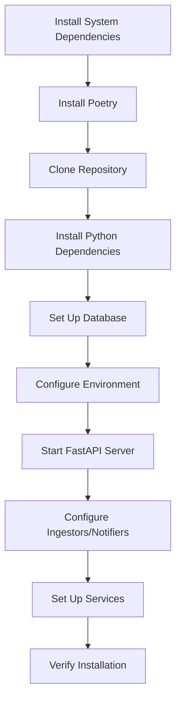

# Installation

This guide provides step-by-step instructions for installing the `analyzer-d4-passivedns` server, a FastAPI-based Passive DNS server compliant with the [Passive DNS - Common Output Format (draft-dulaunoy-dnsop-passive-dns-cof)](https://tools.ietf.org/html/draft-dulaunoy-dnsop-passive-dns-cof). It covers prerequisites, dependency installation, database setup, and initial configuration.

## Prerequisites

- **Operating System**: Linux (e.g., Ubuntu 20.04+ recommended).
- **Python**: 3.8 or higher.
- **Database**: Redis (>5.0) or [KV Rocks](https://github.com/apache/incubator-kvrocks).
- **Tools**:
  - Git for cloning the repository.
  - Poetry for dependency management.
  - `make`, `gcc`, and `libssl-dev` for building dependencies.
- **Permissions**: Root or sudo access for system packages and services.

## Installation Steps

### 1. Install System Dependencies

Update the system and install required packages:

```bash
sudo apt update
sudo apt install -y python3 python3-pip git make gcc libssl-dev
```

### 2. Install Poetry

Install Poetry for managing Python dependencies:

```bash
curl -sSL https://install.python-poetry.org | python3 -
```

Add Poetry to your PATH (add to `~/.bashrc` or equivalent):

```bash
export PATH="$HOME/.local/bin:$PATH"
source ~/.bashrc
```

Verify:

```bash
poetry --version
```

### 3. Clone the Repository

Clone the `analyzer-d4-passivedns` repository:

```bash
git clone https://github.com/D4-project/analyzer-d4-passivedns.git
cd analyzer-d4-passivedns
```

### 4. Install Python Dependencies

Install project dependencies using Poetry:

```bash
poetry install
```

This creates a virtual environment and installs dependencies from `pyproject.toml`.

### 5. Set Up the Database

Choose and install a database backend (Redis or KV Rocks).

#### Option 1: Redis

1. Install Redis:

   ```bash
   ./bin/install_server_redis.sh
   ```

2. Start Redis:

   ```bash
   ./redis/src/redis-server ./etc/redis.conf
   ```

3. Verify:

   ```bash
   redis-cli -p 6379 ping
   ```

   Expected output: `PONG`

#### Option 2: KV Rocks

1. Install KV Rocks:

   ```bash
   ./bin/install_server_kvrocks.sh
   ```

2. Start KV Rocks:

   ```bash
   ./kvrocks/src/kvrocks -c ./etc/kvrocks.conf
   ```

3. Verify:

   ```bash
   ./kvrocks/src/kvrocks-cli -p 6666 PING
   ```

   Expected output: `PONG`

### 6. Configure the Environment

1. Set `PDNS_HOME`:

   ```bash
   export PDNS_HOME=$(pwd)
   ```

   Add to `~/.bashrc` for persistence:

   ```bash
   echo 'export PDNS_HOME=/path/to/analyzer-d4-passivedns' >> ~/.bashrc
   source ~/.bashrc
   ```

2. Copy the sample configuration:

   ```bash
   cp config/generic.json.sample config/generic.json
   ```

3. Edit `config/generic.json` to match your database:

   ```json
   {
     "database": {
       "type": "redis",
       "config": {
         "host": "localhost",
         "port": 6379,
         "db": 0
       }
     },
     "rrset_supported": ["A", "AAAA", "CNAME"],
     "excludesubstrings": [],
     "expiration": {
       "A": 86400,
       "AAAA": 86400,
       "CNAME": 86400
     },
     "ingestors": {},
     "notifiers": {},
     "auth": {
       "endpoints": {
         "query": {"auth": "bearer"}
       },
       "tokens": [
         {"name": "user", "value": "xyz123"}
       ]
     }
   }
   ```

4. Validate the configuration:

   ```bash
   python tools/validate_config_files.py --check
   ```

   Fix issues or update missing fields:

   ```bash
   python tools/validate_config_files.py --update
   ```

### 7. Start the FastAPI Server

Run the FastAPI server to test the installation:

```bash
poetry run uvicorn pdns.main:app --host 0.0.0.0 --port 8000
```

Verify by accessing the OpenAPI documentation:

```bash
curl http://localhost:8000/docs
```

Or test the `/info` endpoint:

```bash
curl http://localhost:8000/info
```

Expected response:

```json
{
  "version": "1.0.0",
  "software": "analyzer-d4-passivedns",
  "stats": { "total_records": 0 },
  "sensors": []
}
```

### 8. Configure Ingestors and Notifiers (Optional)

Add ingestors and notifiers to `generic.json` for data collection and alerts.

- **Example Ingestor**:

  ```json
  {
    "ingestors": {
      "cof_ingestor": {
        "type": "cof",
        "config": {
          "websocket": "ws://crh.circl.lu:8888",
          "frequency": "realtime"
        }
      }
    }
  }
  ```

- **Example Notifier**:

  ```json
  {
    "notifiers": {
      "log_alert": {
        "type": "log",
        "config": {
          "name": "log_alert",
          "condition": {"rrtype": "A"},
          "level": "info"
        }
      }
    }
  }
  ```

See [Ingestors](./ingestors.md) and [Notifiers](./notifiers.md) for details.

### 9. Set Up as a Service (Optional)

For production, run the server and ingestors as `systemd` services.

- **FastAPI Server**:

  ```bash
  sudo nano /etc/systemd/system/pdns.service
  ```

  ```ini
  [Unit]
  Description=Analyzer D4 Passive DNS Server
  After=network.target
  
  [Service]
  User=<user>
  WorkingDirectory=/path/to/analyzer-d4-passivedns
  Environment="PDNS_HOME=/path/to/analyzer-d4-passivedns"
  ExecStart=/path/to/poetry run uvicorn pdns.main:app --host 0.0.0.0 --port 8000
  Restart=always
  
  [Install]
  WantedBy=multi-user.target
  ```

  ```bash
  sudo systemctl enable pdns.service
  sudo systemctl start pdns.service
  ```

- **COF Ingestor**:

  ```bash
  sudo nano /etc/systemd/system/pdns-cof.service
  ```

  ```ini
  [Unit]
  Description=Analyzer D4 COF Ingestor
  After=network.target
  
  [Service]
  User=<user>
  WorkingDirectory=/path/to/analyzer-d4-passivedns
  Environment="PDNS_HOME=/path/to/analyzer-d4-passivedns"
  ExecStart=/path/to/poetry run pdns ingest --websocket ws://crh.circl.lu:8888
  Restart=always
  
  [Install]
  WantedBy=multi-user.target
  ```

  ```bash
  sudo systemctl enable pdns-cof.service
  sudo systemctl start pdns-cof.service
  ```

## Troubleshooting Installation

- **Poetry Fails**:
  - Ensure Python 3.8+:
    ```bash
    python3 --version
    ```
  - Reinstall Poetry:
    ```bash
    curl -sSL https://install.python-poetry.org | python3 -
    ```

- **Database Connection Errors**:
  - Verify database is running:
    ```bash
    redis-cli -p 6379 ping
    ```
  - Check `generic.json`:
    ```json
    {
      "database": {
        "type": "redis",
        "config": {
          "host": "localhost",
          "port": 6379,
          "db": 0
        }
      }
    }
    ```

- **Server Not Accessible**:
  - Check logs:
    ```bash
    tail -f pdns.log | grep "ERROR"
    ```
  - Ensure port 8000 is open:
    ```bash
    netstat -tuln | grep 8000
    ```

See [Troubleshooting](./troubleshooting.md) for more details.

## Best Practices

- **Secure Configurations**:
  ```bash
  chmod 600 config/generic.json
  chmod 600 config/logging.json
  ```
- **Backups**: Back up `config/` and database snapshots.
- **Logging**:
  1. Copy the sample file:
     ```bash
     cp config/logging.json.sample config/logging.json
     ```
  2. Adjust for production, for example:
     ```json
     {
       "level": "INFO",
       "file": "pdns.log"
     }
     ```
- **Updates**: Regularly update dependencies:
  ```bash
  poetry update
  ```

## Mermaid Diagram: Installation Workflow



For related guides, see:

- [Configuration](./configuration.md)
- [Server Management](./management.md)
- [Ingestors](./ingestors.md)
- [Notifiers](./notifiers.md)
- [Troubleshooting](./troubleshooting.md)