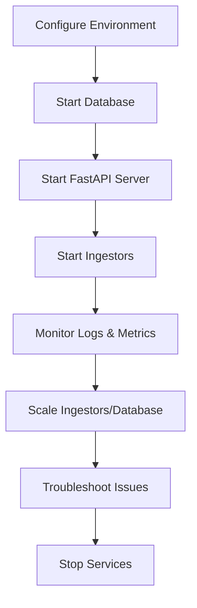

# Server Management

This guide provides instructions for managing the `analyzer-d4-passivedns` server, a FastAPI-based Passive DNS server compliant with the [Passive DNS - Common Output Format (draft-dulaunoy-dnsop-passive-dns-cof)](https://tools.ietf.org/html/draft-dulaunoy-dnsop-passive-dns-cof). It covers starting, stopping, monitoring, and scaling the server, ingestors, and database backends.

## Prerequisites

- **Environment**: `PDNS_HOME` set to the project root:
  ```bash
  export PDNS_HOME=/path/to/analyzer-d4-passivedns
  ```
- **Configuration**: Valid `config/generic.json` and `config/logging.json`.
- **Database**: Running Redis (>5.0) or KV Rocks.
- **Dependencies**: Installed via Poetry:
  ```bash
  poetry install
  ```

## Starting the Server

The FastAPI server hosts the API endpoints (`/info`, `/query`, `/fquery`, `/stream`) and manages notifiers.

1. **Start the FastAPI Server**:

   ```bash
   poetry run uvicorn pdns.main:app --host 0.0.0.0 --port 8000
   ```

   - Use `--reload` for development to auto-restart on code changes:
     ```bash
     poetry run uvicorn pdns.main:app --host 0.0.0.0 --port 8000 --reload
     ```

2. **Verify**:

   - Check the API:
     ```bash
     curl http://localhost:8000/info
     ```
   - Expected response:
     ```json
     {
       "version": "1.0.0",
       "software": "analyzer-d4-passivedns",
       "stats": { "total_records": 10000 },
       "sensors": [ { "sensor_id": "sensor1", "count": 5000 } ]
     }
     ```

3. **Run as a Service**:

   - Use `systemd` for production:
     ```bash
     sudo nano /etc/systemd/system/pdns.service
     ```
     ```ini
     [Unit]
     Description=Analyzer D4 Passive DNS Server
     After=network.target
     
     [Service]
     User=<user>
     WorkingDirectory=/path/to/analyzer-d4-passivedns
     Environment="PDNS_HOME=/path/to/analyzer-d4-passivedns"
     ExecStart=/path/to/poetry run uvicorn pdns.main:app --host 0.0.0.0 --port 8000
     Restart=always
     
     [Install]
     WantedBy=multi-user.target
     ```
     ```bash
     sudo systemctl enable pdns.service
     sudo systemctl start pdns.service
     ```

## Starting Ingestors

Ingestors run as separate processes to collect DNS data.

1. **Start a COF Ingestor**:

   ```bash
   poetry run python bin/pdns-import-cof.py --websocket ws://crh.circl.lu:8888
   ```

2. **Start a D4 Ingestor**:

   ```bash
   poetry run python bin/pdns-ingestion.py
   ```

3. **Run as a Service**:

   - Example `systemd` unit for COF ingestor:
     ```bash
     sudo nano /etc/systemd/system/pdns-cof.service
     ```
     ```ini
     [Unit]
     Description=Analyzer D4 COF Ingestor
     After=network.target
     
     [Service]
     User=<user>
     WorkingDirectory=/path/to/analyzer-d4-passivedns
     Environment="PDNS_HOME=/path/to/analyzer-d4-passivedns"
     ExecStart=/path/to/poetry run python bin/pdns-import-cof.py --websocket ws://crh.circl.lu:8888
     Restart=always
     
     [Install]
     WantedBy=multi-user.target
     ```
     ```bash
     sudo systemctl enable pdns-cof.service
     sudo systemctl start pdns-cof.service
     ```

## Stopping the Server

1. **Stop the FastAPI Server**:

   - If running manually:
     ```bash
     Ctrl+C
     ```
   - If running as a service:
     ```bash
     sudo systemctl stop pdns.service
     ```

2. **Stop Ingestors**:

   - Find the process ID:
     ```bash
     ps aux | grep pdns-import-cof
     ```
   - Terminate:
     ```bash
     kill <pid>
     ```
   - Or stop the service:
     ```bash
     sudo systemctl stop pdns-cof.service
     ```

## Monitoring

1. **Logs**:

   - Check server and notifier logs:
     ```bash
     tail -f pdns.log
     ```
   - Filter for specific events:
     ```bash
     tail -f pdns.log | grep "notify"
     ```

2. **Database Metrics**:

   - **Redis**:
     ```bash
     redis-cli -p 6379 INFO MEMORY
     redis-cli -p 6379 INFO STATS
     ```
   - **KV Rocks**:
     ```bash
     ./kvrocks/src/kvrocks-cli -p 6666 INFO
     ```

3. **API Health**:

   - Monitor `/info` endpoint:
     ```bash
     curl http://localhost:8000/info
     ```

## Scaling

1. **Multiple Ingestors**:

   - Add more ingestors in `generic.json`:
     ```json
     {
       "ingestors": {
         "cof1": {
           "type": "cof",
           "config": {
             "websocket": "ws://crh.circl.lu:8888"
           }
         },
         "cof2": {
           "type": "cof",
           "config": {
             "websocket": "ws://other.source:8888"
           }
         }
       }
     }
     ```
   - Run each ingestor separately:
     ```bash
     poetry run python bin/pdns-import-cof.py --websocket ws://other.source:8888
     ```

2. **Database Scaling**:

   - Use Redis Cluster or KV Rocks sharding for high loads.
   - Adjust `expiration` in `generic.json` to manage storage:
     ```json
     {
       "expiration": {
         "A": 86400,
         "AAAA": 86400
       }
     }
     ```

3. **Load Balancing**:

   - Deploy multiple FastAPI instances behind a load balancer (e.g., Nginx):
     ```nginx
     upstream pdns {
         server 127.0.0.1:8000;
         server 127.0.0.1:8001;
     }
     server {
         listen 80;
         location / {
             proxy_pass http://pdns;
         }
     }
     ```

## Troubleshooting

- **Server Not Starting**:
  - Check `pdns.log` for errors:
    ```bash
    tail -f pdns.log | grep "ERROR"
    ```
  - Validate `generic.json`:
    ```bash
    python tools/validate_config_files.py --check
    ```
  - Ensure database is running:
    ```bash
    redis-cli -p 6379 ping
    ```

- **Ingestors Not Processing**:
  - Verify source connectivity:
    ```bash
    curl ws://crh.circl.lu:8888
    ```
  - Check `rrset_supported` in `generic.json`:
    ```json
    {
      "rrset_supported": ["A", "AAAA"]
    }
    ```

- **High Resource Usage**:
  - Monitor database memory:
    ```bash
    redis-cli -p 6379 INFO MEMORY
    ```
  - Reduce `expiration` or scale the database.

## Best Practices

- **Service Management**: Use `systemd` for reliable server and ingestor management.
- **Logging**: Configure `logging.json` for appropriate log levels:
  ```json
  {
    "level": "INFO",
    "file": "pdns.log"
  }
  ```
- **Backups**: Regularly back up `config/` and database snapshots.
- **Security**: Restrict access to sensitive endpoints in `generic.json`:
  ```json
  {
    "auth": {
      "endpoints": {
        "query": {"auth": "bearer"}
      },
      "tokens": {
        "user": "xyz123"
      }
    }
  }
  ```

## Mermaid Diagram: Server Management Workflow



For related guides, see:

- [Installation](./installation.md)
- [Configuration](./configuration.md)
- [Ingestors](./ingestors.md)
- [Notifiers](./notifiers.md)
- [Troubleshooting](./troubleshooting.md)