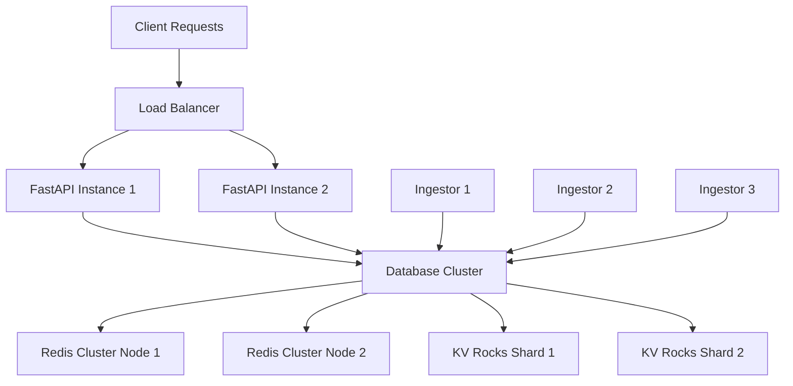

# Advanced Scaling Guide

This guide explains how to scale the `analyzer-d4-passivedns` server to handle high-traffic DNS data processing, ensuring performance and reliability. The server is a FastAPI-based Passive DNS server compliant with the [Passive DNS - Common Output Format (draft-dulaunoy-dnsop-passive-dns-cof)](https://tools.ietf.org/html/draft-dulaunoy-dnsop-passive-dns-cof). It covers scaling ingestors, FastAPI instances, and database backends (Redis Cluster, KV Rocks sharding).

## Prerequisites

- **Existing Deployment**: Server running with Redis or KV Rocks (see [Deployment](../admin/deployment.md)).
- **Configuration**: Valid `config/generic.json` and `config/logging.json`.
- **Tools**: Docker, Nginx, or AWS ELB for load balancing; Redis Cluster or KV Rocks for database scaling.
- **Monitoring**: Ability to monitor CPU, memory, and database metrics.

## Scaling Ingestors

Ingestors collect DNS data and can be scaled by adding more instances.

### Step 1: Add Ingestors

Update `generic.json` with multiple ingestors:

```json
{
  "ingestors": {
    "cof1": {
      "type": "cof",
      "config": {
        "websocket": "ws://crh.circl.lu:8888",
        "frequency": "realtime"
      }
    },
    "cof2": {
      "type": "cof",
      "config": {
        "websocket": "ws://other.source:8888",
        "frequency": "realtime"
      }
    },
    "d4_ingestor": {
      "type": "d4",
      "config": {
        "server": "127.0.0.1:6380",
        "uuid": "6072e072-bfaa-4395-9bb1-cdb3b470d715"
      }
    }
  }
}
```

### Step 2: Run Ingestors

Run each ingestor as a separate process or container:

```bash
poetry run python bin/pdns-import-cof.py --websocket ws://crh.circl.lu:8888 &
poetry run python bin/pdns-import-cof.py --websocket ws://other.source:8888 &
poetry run python bin/pdns-ingestion.py &
```

For Docker, extend `docker-compose.yml`:

```yaml
services:
  pdns-cof1:
    build: .
    command: ["poetry", "run", "python", "bin/pdns-import-cof.py", "--websocket", "ws://crh.circl.lu:8888"]
  pdns-cof2:
    build: .
    command: ["poetry", "run", "python", "bin/pdns-import-cof.py", "--websocket", "ws://other.source:8888"]
  pdns-d4:
    build: .
    command: ["poetry", "run", "python", "bin/pdns-ingestion.py"]
```

### Step 3: Monitor Ingestors

Check logs for ingestion rates:

```bash
tail -f pdns.log | grep "ingestor"
```

## Scaling FastAPI Instances

Run multiple FastAPI instances behind a load balancer.

### Step 1: Deploy Multiple Instances

Update `docker-compose.yml` for multiple server instances:

```yaml
services:
  pdns1:
    build: .
    ports:
      - "8000:8000"
  pdns2:
    build: .
    ports:
      - "8001:8000"
```

Or run manually:

```bash
poetry run uvicorn pdns.main:app --host 0.0.0.0 --port 8000 &
poetry run uvicorn pdns.main:app --host 0.0.0.0 --port 8001 &
```

### Step 2: Set Up Load Balancing

Use Nginx as a reverse proxy:

```bash
sudo apt install -y nginx
sudo nano /etc/nginx/sites-available/pdns
```

```nginx
upstream pdns {
    server 127.0.0.1:8000;
    server 127.0.0.1:8001;
}
server {
    listen 80;
    server_name pdns.example.com;
    location / {
        proxy_pass http://pdns;
        proxy_set_header Host $host;
        proxy_set_header X-Real-IP $remote_addr;
    }
}
```

Enable and restart Nginx:

```bash
sudo ln -s /etc/nginx/sites-available/pdns /etc/nginx/sites-enabled/
sudo systemctl restart nginx
```

For AWS, use an Application Load Balancer (see [Deployment](../admin/deployment.md)).

### Step 3: Test Load Balancing

```bash
curl http://pdns.example.com/info
```

## Scaling Database

Use Redis Cluster or KV Rocks sharding for high data volumes.

### Option 1: Redis Cluster

1. **Set Up Redis Cluster**:
   Install Redis and create a cluster with 6 nodes (3 masters, 3 replicas):

   ```bash
   ./bin/install_server_redis.sh
   redis-cli --cluster create 127.0.0.1:7000 127.0.0.1:7001 127.0.0.1:7002 127.0.0.1:7003 127.0.0.1:7004 127.0.0.1:7005 --cluster-replicas 1
   ```

2. **Update `generic.json`**:

   ```json
   {
     "database": {
       "type": "redis",
       "config": {
         "cluster": [
           {"host": "127.0.0.1", "port": 7000},
           {"host": "127.0.0.1", "port": 7001},
           {"host": "127.0.0.1", "port": 7002}
         ]
       }
     }
   }
   ```

3. **Monitor**:
   ```bash
   redis-cli -p 7000 cluster info
   ```

### Option 2: KV Rocks Sharding

1. **Set Up KV Rocks**:
   Install KV Rocks and configure sharding:

   ```bash
   ./bin/install_server_kvrocks.sh
   ```

   Start multiple instances:

   ```bash
   ./kvrocks/src/kvrocks -c ./etc/kvrocks1.conf --port 6666 &
   ./kvrocks/src/kvrocks -c ./etc/kvrocks2.conf --port 6667 &
   ```

2. **Update `generic.json`**:

   ```json
   {
     "database": {
       "type": "kvrocks",
       "config": {
         "shards": [
           {"host": "127.0.0.1", "port": 6666},
           {"host": "127.0.0.1", "port": 6667}
         ]
       }
     }
   }
   ```

3. **Monitor**:
   ```bash
   ./kvrocks/src/kvrocks-cli -p 6666 INFO
   ```

### Step 4: Optimize Data Retention

Reduce database load by adjusting `expiration` in `generic.json`:

```json
{
  "expiration": {
    "A": 43200,
    "AAAA": 43200,
    "CNAME": 43200
  }
}
```

## Best Practices

- **Rate Limiting**: Configure strict limits in `generic.json`:
  ```json
  {
    "rate_limit": {
      "query": {"requests": 50, "window": 60}
    }
  }
  ```
- **Monitoring**: Use tools like Prometheus and Grafana for metrics.
- **Redundancy**: Deploy databases and servers across multiple availability zones.
- **Backups**: Schedule regular database snapshots.

## Mermaid Diagram: Scaling Architecture



## Troubleshooting

- **High Latency**:
  - Check database metrics: `redis-cli -p 7000 INFO`
  - Optimize `expiration` settings.
- **Ingestor Overload**:
  - Monitor logs: `tail -f pdns.log | grep "ingestor"`
  - Add more ingestors.
- **Connection Errors**:
  - Verify cluster/shard configuration in `generic.json`.

See [Troubleshooting](../admin/troubleshooting.md) for more help.

For related guides, see:

- [Deployment](../admin/deployment.md)
- [Server Management](../admin/management.md)
- [Configuration](../admin/configuration.md)
- [Ingestors](../admin/ingestors.md)