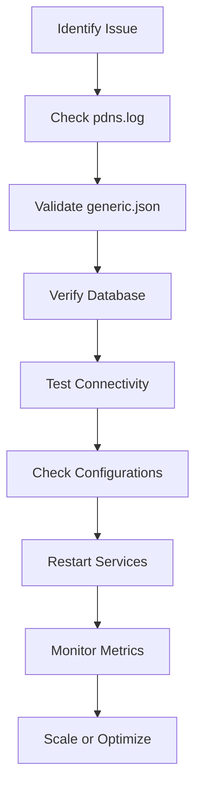

# Troubleshooting

This guide provides troubleshooting steps for common issues in the `analyzer-d4-passivedns` server, a FastAPI-based Passive DNS server compliant with the [Passive DNS - Common Output Format (draft-dulaunoy-dnsop-passive-dns-cof)](https://tools.ietf.org/html/draft-dulaunoy-dnsop-passive-dns-cof). It covers problems with the FastAPI server, ingestors, notifiers, and database backends (Redis, KV Rocks).

## Prerequisites

- **Logs**: Access to `pdns.log` (configured in `config/logging.json`).
- **Environment**: `PDNS_HOME` set:
  ```bash
  export PDNS_HOME=/path/to/analyzer-d4-passivedns
  ```
- **Tools**: `curl`, `redis-cli`, `telnet`, or equivalent for diagnostics.

## Common Issues and Solutions

### 1. FastAPI Server Not Starting

- **Symptoms**: `uvicorn` fails to start, or `curl http://localhost:8000/info` returns a connection error.
- **Solutions**:
  1. **Check Logs**:
     ```bash
     tail -f pdns.log | grep "ERROR"
     ```
     Look for errors like `DBConnectionError` or `ConfigurationError`.
  2. **Validate Configuration**:
     ```bash
     python tools/validate_config_files.py --check
     ```
     Fix issues or update from `generic.json.sample`:
     ```bash
     python tools/validate_config_files.py --update
     ```
  3. **Verify Database**:
     - For Redis:
       ```bash
       redis-cli -p 6379 ping
       ```
       If it fails, start Redis:
       ```bash
       ./redis/src/redis-server ./etc/redis.conf
       ```
     - For KV Rocks:
       ```bash
       ./kvrocks/src/kvrocks-cli -p 6666 PING
       ```
       If it fails, start KV Rocks:
       ```bash
       ./kvrocks/src/kvrocks -c ./etc/kvrocks.conf
       ```
  4. **Check Port**:
     ```bash
     netstat -tuln | grep 8000
     ```
     If port 8000 is in use, change the port in `uvicorn`:
     ```bash
     poetry run uvicorn pdns.main:app --host 0.0.0.0 --port 8001
     ```

### 2. Ingestors Not Processing Data

- **Symptoms**: No new records in the database, logs show `ingest_failed` or no activity.
- **Solutions**:
  1. **Check Logs**:
     ```bash
     tail -f pdns.log | grep "ingestor"
     ```
     Look for errors like connection failures or parsing issues.
  2. **Verify Source Connectivity**:
     - For COF ingestor:
       ```bash
       curl ws://crh.circl.lu:8888
       ```
     - For D4 ingestor, check server and UUID in `generic.json`:
       ```json
       {
         "ingestors": {
           "d4_ingestor": {
             "type": "d4",
             "config": {
               "server": "127.0.0.1:6380",
               "uuid": "6072e072-bfaa-4395-9bb1-cdb3b470d715"
             }
           }
         }
       }
       ```
  3. **Check Supported Record Types**:
     Ensure `rrset_supported` includes desired types:
     ```json
     {
       "rrset_supported": ["A", "AAAA", "CNAME"]
     }
     ```
     Update `rrtypes.json` if needed:
     ```bash
     python tools/3rdparty.py
     ```
  4. **Restart Ingestor**:
     ```bash
     poetry run python bin/pdns-import-cof.py --websocket ws://crh.circl.lu:8888
     ```

### 3. Notifiers Not Sending Alerts

- **Symptoms**: No alerts received, logs show `notify_failed` or no activity.
- **Solutions**:
  1. **Check Logs**:
     ```bash
     tail -f pdns.log | grep "notify"
     ```
     Look for errors like `Connection refused` or `Invalid credentials`.
  2. **Verify Configuration**:
     - For `log` notifier in `generic.json`:
       ```json
       {
         "notifiers": {
           "log_alert": {
             "type": "log",
             "config": {
               "name": "log_alert",
               "condition": {"rrtype": "A"},
               "level": "info"
             }
           }
         }
       }
       ```
     - For others (e.g., `mail`), check `pdns/notifiers/mail/config.json`:
       ```json
       {
         "name": "mail_alert",
         "condition": {"rrtype": "A"},
         "smtp_host": "smtp.example.com",
         "smtp_port": 587,
         "sender": "alerts@example.com",
         "recipient": "admin@example.com"
       }
       ```
  3. **Test Connectivity**:
     - For `mail`:
       ```bash
       telnet smtp.example.com 587
       ```
     - For `webhook`:
       ```bash
       curl https://webhook.example.com/notify
       ```
  4. **Check Conditions**:
     Ensure conditions match incoming records:
     ```json
     {
       "condition": {"rrtype": "A", "rrname": "example.com"}
     }
     ```
  5. **Restart Server**:
     ```bash
     poetry run uvicorn pdns.main:app --host 0.0.0.0 --port 8000
     ```
     Note: Notifications are not retried on failure to minimize load.

### 4. API Returns Errors

- **Symptoms**: HTTP 401, 429, or 500 errors from endpoints.
- **Solutions**:
  1. **401 Unauthorized**:
     - Verify token in `generic.json`:
       ```json
       {
         "auth": {
           "endpoints": {
             "query": {"auth": "bearer"}
           },
           "tokens": {
             "user": "xyz123"
           }
         }
       }
       ```
     - Include token in request:
       ```bash
       curl -H "Authorization: Bearer xyz123" http://localhost:8000/query/example.com
       ```
  2. **429 Too Many Requests**:
     - Check rate limits in `generic.json`:
       ```json
       {
         "rate_limit": {
           "query": {"requests": 100, "window": 60}
         }
       }
       ```
     - Wait or adjust limits and restart the server.
  3. **500 Internal Server Error**:
     - Check logs for details:
       ```bash
       tail -f pdns.log | grep "ERROR"
       ```
     - Ensure database is running and configured correctly.

### 5. High Resource Usage

- **Symptoms**: High CPU/memory usage or slow API responses.
- **Solutions**:
  1. **Monitor Database**:
     - Redis:
       ```bash
       redis-cli -p 6379 INFO MEMORY
       ```
     - KV Rocks:
       ```bash
       ./kvrocks/src/kvrocks-cli -p 6666 INFO
       ```
  2. **Reduce Data Retention**:
     Adjust `expiration` in `generic.json`:
     ```json
     {
       "expiration": {
         "A": 86400,
         "AAAA": 86400
       }
     }
     ```
  3. **Scale Resources**:
     - Add more ingestors or use Redis Cluster/KV Rocks sharding.
     - Deploy multiple FastAPI instances with load balancing (see [Server Management](./management.md)).
  4. **Optimize Ingestors**:
     Check logs for slow ingestion:
     ```bash
     tail -f pdns.log | grep "ingestor"
     ```

## General Tips

- **Validate Configurations**:
  ```bash
  python tools/validate_config_files.py --check
  ```
- **Secure Files**:
  ```bash
  chmod 600 config/generic.json
  ```
- **Backup Configurations**:
  Regularly back up `config/` and database snapshots.
- **Update Dependencies**:
  ```bash
  poetry update
  ```

## Mermaid Diagram: Troubleshooting Workflow



For related guides, see:

- [Installation](./installation.md)
- [Configuration](./configuration.md)
- [Server Management](./management.md)
- [Ingestors](./ingestors.md)
- [Notifiers](./notifiers.md)