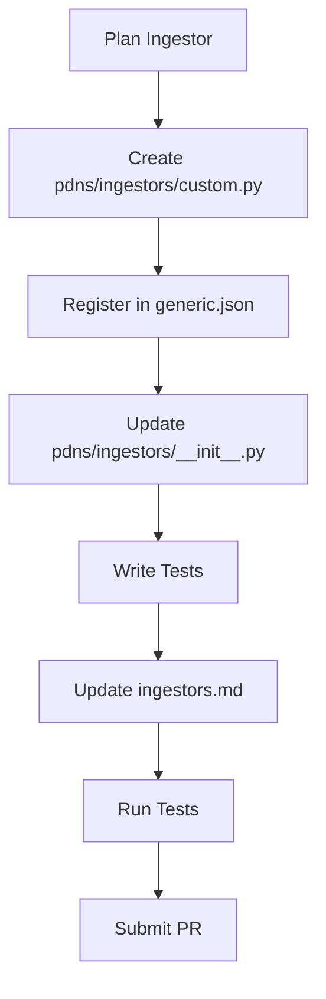

# Adding Ingestors

This guide explains how to add a new ingestor to the `analyzer-d4-passivedns` project, a FastAPI-based Passive DNS server compliant with the [Passive DNS - Common Output Format (draft-dulaunoy-dnsop-passive-dns-cof)](https://tools.ietf.org/html/draft-dulaunoy-dnsop-passive-dns-cof). Ingestors collect DNS data from various sources (e.g., COF websockets, D4 servers, custom feeds) and store it in the database (e.g., Redis, KV Rocks).

## Overview

Ingestors are modular and dynamically loaded from `config/generic.json`. Each ingestor resides in `pdns/ingestors/` and implements a class that processes DNS records and interacts with the `DBManager`. Ingestors typically run as separate processes via scripts in `bin/`, independent of the FastAPI server.

## Ingestor Architecture

Ingestors are organized in the `pdns/ingestors/` submodule, with a modular design based on inheritance from base classes defined in `pdns/ingestors/base.py`. The structure is divided into:

- **File Ingestors** (`pdns/ingestors/file/`): Process static files, with subdirectories:
  - `line/`: Line-based text files (e.g., `pdns`, `ndjson`, `zeek`).
  - `json/`: JSON array files (e.g., `json`).
  - `frame/`: Binary framed data (e.g., `dnstap_file`, `pcap_file`).
- **Stream Ingestors** (`pdns/ingestors/stream/`): Process real-time streams (e.g., `redis_queue`, `dnstap_socket`, `websocket`).

### Base Classes

All ingestors inherit from `Ingestor` or its specialized subclasses:

- **`Ingestor` (base.py)**: Abstract base class with methods `run()` (starts the ingestor) and `process()` (processes data into `PDNSRecord` objects).
- **`FileIngestor` (base.py)**: For file-based ingestors, handles file reading and iteration.
- **`LineIngestor` (base.py)**: Extends `FileIngestor` for line-by-line text processing.
- **`FrameIngestor` (base.py)**: Extends `FileIngestor` for binary framed data.
- **`StreamIngestor` (base.py)**: For stream-based ingestors, handles continuous data sources.

Each ingestor must implement:
- `process()`: Converts raw data (e.g., a line, frame, or message) into a list of `PDNSRecord` objects.
- `run()`: Orchestrates data retrieval and processing, typically calling `process()` and storing results via `DatabaseManager`.


## Steps to Add a New Ingestor

1. **Create the Ingestor File**:

   - Create `pdns/ingestors/custom.py`:
     ```python
     from .base import BaseIngestor
     from ..db.manager import DBManager
     from ..schemas import DNSRecord
     from ..default.helpers import logger
     
     class CustomIngestor(BaseIngestor):
         def __init__(self, config: dict, db: DBManager):
             super().__init__(config, db)
             self.source = config.get("source", "default_source")
         
         async def run(self):
             try:
                 # Implement logic to fetch data from source
                 records = await self.fetch_records()
                 for record in records:
                     await self.db.store(record)
                 logger.info({"event": "custom_ingest", "count": len(records)})
             except Exception as e:
                 logger.error({"event": "custom_ingest_failed", "error": str(e)})
         
         async def fetch_records(self) -> list[DNSRecord]:
             # Implement source-specific logic
             return [
                 DNSRecord(
                     rrname="example.com",
                     rrtype="A",
                     rdata="93.184.216.34",
                     time_first=1698777600,
                     time_last=1698777600,
                     count=1,
                     sensor_id="custom"
                 )
             ]
     ```

   - Key requirements:
     - Subclass `BaseIngestor`.
     - Implement `run` to orchestrate ingestion.
     - Implement `fetch_records` to retrieve and parse data.
     - Use `self.db.store` to save `DNSRecord` objects.
     - Log errors without raising exceptions to ensure robustness.

2. **Register the Ingestor**:

   - Add to `config/generic.json`:
     ```json
     {
       "ingestors": {
         "custom_ingestor": {
           "type": "custom",
           "config": {
             "source": "https://api.example.com/dns",
             "frequency": "realtime"
           }
         }
       }
     }
     ```

   - Fields:
     - `type`: Must match the ingestor class (e.g., `custom`).
     - `config`: Source-specific settings (e.g., `source`, `frequency`).

3. **Wire the Ingestor into the CLI**:

   - Ensure `pdns/ingestors/__init__.py` exports the new ingestor:
     ```python
     from .custom import CustomIngestor
     ```

   - The ingestor is dynamically loaded based on `generic.json`.

5. **Test the Ingestor**:

   - Create `tests/test_ingestors/test_custom.py`:
     ```python
     import pytest
     from pdns.ingestors.custom import CustomIngestor
     from pdns.db.manager import DBManager
     from pdns.schemas import DNSRecord
     
     @pytest.mark.asyncio
     async def test_custom_ingestor():
         db = DBManager()  # Mock or use test DB
         config = {"source": "test"}
         ingestor = CustomIngestor(config, db)
         records = await ingestor.fetch_records()
         assert len(records) > 0
         assert isinstance(records[0], DNSRecord)
     ```

   - Run tests:
     ```bash
     poetry run pytest tests/test_ingestors/test_custom.py
     ```

6. **Update Documentation**:

   - Add to `docs/admin/ingestors.md`:
     ```markdown
     - **Custom Ingestor**: Fetches DNS data from a custom API.
       - **Config**: `source` (API URL), `frequency` (e.g., `realtime`).
       - **Example**:
         ```json
         {
           "type": "custom",
           "config": {
             "source": "https://api.example.com/dns",
             "frequency": "realtime"
           }
         }
         ```
     ```

## Mermaid Diagram: Ingestor Development Workflow



## Best Practices

- **Error Handling**: Log errors in `run` and `fetch_records` without raising exceptions:
  ```python
  logger.error({"event": "custom_ingest_failed", "error": str(e)})
  ```
- **Performance**: Use async I/O for fetching data (e.g., `aiohttp` for APIs):
  ```python
  import aiohttp
  async def fetch_records(self):
      async with aiohttp.ClientSession() as session:
          async with session.get(self.source) as resp:
              return await resp.json()
  ```
- **Validation**: Ensure `DNSRecord` objects are valid before storing:
  ```python
  record = DNSRecord(**data)
  ```
- **Testing**: Mock external sources in tests using `unittest.mock`.
- **Documentation**: Update `ingestors.md` with clear configuration examples.

## Example: Implementing a REST API Ingestor

1. Create `pdns/ingestors/rest_api.py`:
   ```python
   from .base import BaseIngestor
   from ..db.manager import DBManager
   from ..schemas import DNSRecord
   from ..default.helpers import logger
   import aiohttp
   
   class RestApiIngestor(BaseIngestor):
       def __init__(self, config: dict, db: DBManager):
           super().__init__(config, db)
           self.api_url = config["api_url"]
           self.api_key = config.get("api_key")
       
       async def run(self):
           try:
               records = await self.fetch_records()
               for record in records:
                   await self.db.store(record)
               logger.info({"event": "rest_api_ingest", "count": len(records)})
           except Exception as e:
               logger.error({"event": "rest_api_ingest_failed", "error": str(e)})
       
       async def fetch_records(self) -> list[DNSRecord]:
           async with aiohttp.ClientSession() as session:
               headers = {"Authorization": f"Bearer {self.api_key}"} if self.api_key else {}
               async with session.get(self.api_url, headers=headers) as resp:
                   data = await resp.json()
                   return [DNSRecord(**item) for item in data]
   ```

2. Register in `config/generic.json`:
   ```json
   {
     "ingestors": {
       "rest_api_ingestor": {
         "type": "rest_api",
         "config": {
           "api_url": "https://api.dns.example.com/records",
           "api_key": "abc123",
           "frequency": "hourly"
         }
       }
     }
   }
   ```

3. Update `pdns/ingestors/__init__.py`.
4. Wire it into operational flows via `pdns ingest` and update `ingestors.md`.

For related guides, see:

- [Contributing](./contributing.md)
- [Codebase Overview](./codebase-overview.md)
- [Adding Notifiers](./adding-notifiers.md)
- [API Development](./api-development.md)
- [Testing](./testing.md)