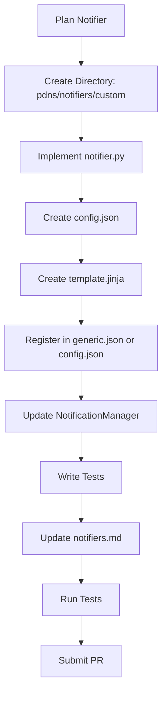

# Adding Notifiers

This guide explains how to add a new notifier to the `analyzer-d4-passivedns` project, a FastAPI-based Passive DNS server compliant with the [Passive DNS - Common Output Format (draft-dulaunoy-dnsop-passive-dns-cof)](https://tools.ietf.org/html/draft-dulaunoy-dnsop-passive-dns-cof). Notifiers send alerts based on DNS record conditions, and their modular design allows developers to extend the system with custom notification mechanisms.

## Overview

Notifiers are managed by the `NotificationManager` in `pdns/db/manager.py` and triggered during DNS record storage when conditions match. Each notifier resides in `pdns/notifiers/<name>/`, containing:

- `notifier.py`: The notifier implementation, subclassing `BaseNotifier`.
- `config.json`: Configuration settings (except for the `log` notifier).
- `template.jinja`: Jinja2 template for alert messages.

The system does not retry failed notifications to minimize load, logging failures instead.

## Steps to Add a New Notifier

1. **Create the Notifier Directory**:

   - Create a new directory in `pdns/notifiers/`:
     ```bash
     mkdir pdns/notifiers/custom
     ```

2. **Implement the Notifier**:

   - Create `pdns/notifiers/custom/notifier.py`:
     ```python
     from ..base import BaseNotifier, DNSRecord
     from ..default.helpers import logger
     
     class CustomNotifier(BaseNotifier):
         async def notify(self, record: DNSRecord) -> None:
             try:
                 message = self.render_template(record)
                 # Implement notification logic (e.g., send to API, log, etc.)
                 logger.info({"event": "custom_notify", "message": message})
             except Exception as e:
                 logger.error({"event": "custom_notify_failed", "error": str(e)})
     ```

   - Key requirements:
     - Subclass `BaseNotifier`.
     - Implement the `notify` method, which processes a `DNSRecord` and sends the alert.
     - Use `self.render_template(record)` to generate the message from `template.jinja`.
     - Log errors without raising exceptions (notifications are fire-and-forget).

3. **Create the Configuration File**:

   - Create `pdns/notifiers/custom/config.json`:
     ```json
     {
       "name": "custom_alert",
       "condition": {"rrtype": "A"},
       "endpoint": "https://api.example.com/notify",
       "api_key": "abc123"
     }
     ```

   - Fields:
     - `name`: Unique alert name.
     - `condition`: Matching conditions (e.g., `{"rrtype": "A"}`, `{"rdata": "in:10.0.0.0/24"}`).
     - Custom fields (e.g., `endpoint`, `api_key`) as needed.

4. **Create the Template**:

   - Create `pdns/notifiers/custom/template.jinja`:
     ```jinja
     New DNS record detected:
     Domain: {{ record.rrname }}
     Type: {{ record.rrtype }}
     Data: {{ record.rdata }}
     First Seen: {{ record.time_first }}
     Sensor: {{ record.sensor_id }}
     ```

   - The template uses Jinja2 syntax and receives a `DNSRecord` object for rendering.

5. **Register the Notifier**:

   - Add the notifier to `config/generic.json`:
     ```json
     {
       "notifiers": {
         "custom_alert": {
           "type": "custom",
           "config": {
             "name": "custom_alert",
             "condition": {"rrtype": "A"},
             "endpoint": "https://api.example.com/notify",
             "api_key": "abc123"
           }
         }
       }
     }
     ```

   - Alternatively, rely on `pdns/notifiers/custom/config.json` and ensure the `NotificationManager` loads it.

6. **Update Notifier Loading**:

   - Ensure `pdns/db/manager.py`’s `NotificationManager` recognizes the new notifier:
     ```python
     from ..notifiers.custom.notifier import CustomNotifier
     # Add to self.notifiers in NotificationManager.__init__
     ```

   - The `NotificationManager` dynamically loads notifiers based on `generic.json` or directory configs.

7. **Test the Notifier**:

   - Create a test in `tests/test_notifiers/test_custom.py`:
     ```python
     import pytest
     from pdns.notifiers.custom.notifier import CustomNotifier
     from pdns.schemas import DNSRecord
     
     @pytest.mark.asyncio
     async def test_custom_notifier():
         notifier = CustomNotifier(config={"name": "custom_alert", "condition": {"rrtype": "A"}})
         record = DNSRecord(
             rrname="example.com",
             rrtype="A",
             rdata="93.184.216.34",
             time_first=1698777600,
             time_last=1698777600,
             count=1,
             sensor_id="sensor1"
         )
         await notifier.notify(record)
         # Assert log output or mock API call
     ```

   - Run tests:
     ```bash
     poetry run pytest tests/test_notifiers/test_custom.py
     ```

8. **Update Documentation**:

   - Add the notifier to `docs/admin/notifiers.md`:
     ```markdown
     - `custom`: Sends alerts to a custom API endpoint.
       - **Config**: `endpoint` (API URL), `api_key` (authentication key).
       - **Example**:
         ```json
         {
           "name": "custom_alert",
           "condition": {"rrtype": "A"},
           "endpoint": "https://api.example.com/notify",
           "api_key": "abc123"
         }
         ```
     ```

## Mermaid Diagram: Notifier Development Workflow



## Best Practices

- **Error Handling**: Log errors in `notify` without raising exceptions, as notifications are not retried.
- **Performance**: Minimize I/O in `notify` (e.g., use async HTTP clients like `aiohttp`).
- **Security**: Secure sensitive config fields (e.g., `api_key`):
  ```bash
  chmod 600 pdns/notifiers/custom/config.json
  ```
- **Testing**: Cover success and failure cases in tests, mocking external services.
- **Documentation**: Ensure `notifiers.md` reflects the new notifier’s usage and configuration.

## Example: Implementing a Slack Notifier

1. Create `pdns/notifiers/slack/notifier.py`:
   ```python
   from ..base import BaseNotifier, DNSRecord
   from ..default.helpers import logger
   import aiohttp
   
   class SlackNotifier(BaseNotifier):
       async def notify(self, record: DNSRecord) -> None:
           try:
               message = self.render_template(record)
               async with aiohttp.ClientSession() as session:
                   await session.post(
                       self.config["webhook_url"],
                       json={"text": message}
                   )
               logger.info({"event": "slack_notify", "rrname": record.rrname})
           except Exception as e:
               logger.error({"event": "slack_notify_failed", "error": str(e)})
   ```

2. Create `pdns/notifiers/slack/config.json`:
   ```json
   {
     "name": "slack_alert",
     "condition": {"rrtype": "A"},
     "webhook_url": "https://hooks.slack.com/services/xxx/yyy/zzz"
   }
   ```

3. Create `pdns/notifiers/slack/template.jinja`:
   ```jinja
   DNS Alert: {{ record.rrname }} ({{ record.rrtype }}) resolved to {{ record.rdata }}
   ```

4. Register in `generic.json` or rely on `config.json`.

5. Update `NotificationManager` and test as described.

For related guides, see:

- [Contributing](./contributing.md)
- [Codebase Overview](./codebase-overview.md)
- [Adding Ingestors](./adding-ingestors.md)
- [API Development](./api-development.md)
- [Testing](./testing.md)