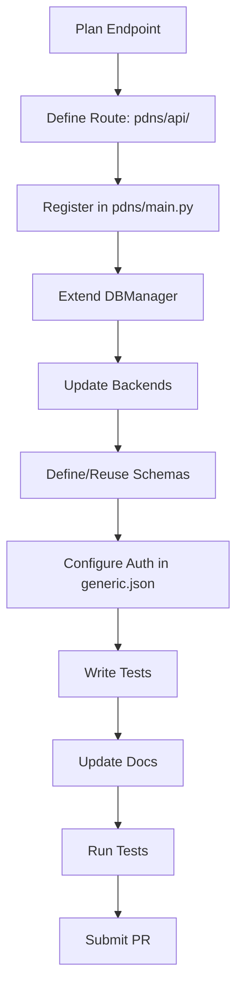

# API Development

This guide explains how to develop and extend the API for the `analyzer-d4-passivedns` project, a FastAPI-based Passive DNS server compliant with the [Passive DNS - Common Output Format (draft-dulaunoy-dnsop-passive-dns-cof)](https://tools.ietf.org/html/draft-dulaunoy-dnsop-passive-dns-cof). It covers adding new endpoints, modifying existing ones, and ensuring compatibility with the auto-generated OpenAPI specification at `http://localhost:8000/docs`.

## Overview

The API is built using FastAPI, providing endpoints like `/info`, `/query/{q}`, `/fquery/{q}`, and `/stream/{q}`. Routes are defined in `pdns/api/`, use Pydantic models in `pdns/schemas/` for validation, and rely on `pdns/db/manager.py` for database interactions. Authentication and rate limiting are configured in `config/generic.json`.

## Steps to Add a New Endpoint

1. **Define the Route**:

   - Create or update a file in `pdns/api/` (e.g., `pdns/api/custom.py`):
     ```python
     from fastapi import APIRouter, Depends
     from pdns.db.manager import DBManager
     from pdns.schemas import DNSRecord
     from pdns.api.dependencies import get_db, require_auth
     
     router = APIRouter(prefix="/custom", tags=["custom"])
     
     @router.get("/{q}", response_model=list[DNSRecord])
     async def custom_query(q: str, db: DBManager = Depends(get_db), auth: bool = Depends(require_auth)):
         # Implement query logic
         records = await db.query_custom(q)
         return records
     ```

   - Key elements:
     - Use `APIRouter` for modular routing.
     - Depend on `get_db` for database access.
     - Use `require_auth` for authentication (configured in `generic.json`).
     - Specify `response_model` with Pydantic schemas.

2. **Register the Route**:

   - In `pdns/main.py`, include the new router:
     ```python
     from pdns.api.custom import router as custom_router
     
     app.include_router(custom_router)
     ```

3. **Extend the Database Manager**:

   - In `pdns/db/manager.py`, add the query logic:
     ```python
     async def query_custom(self, q: str) -> list[DNSRecord]:
         # Implement custom query logic
         records = await self.backend.query_custom(q)
         return [DNSRecord(**record) for record in records]
     ```

   - Update backend implementations (e.g., `pdns/db/backends/redis.py`):
     ```python
     async def query_custom(self, q: str) -> list[dict]:
         # Implement backend-specific query
         return []
     ```

4. **Define or Reuse Schemas**:

   - Use existing `DNSRecord` in `pdns/schemas/` or create a new Pydantic model:
     ```python
     from pydantic import BaseModel
     
     class CustomResponse(BaseModel):
         query: str
         results: list[DNSRecord]
     ```

5. **Configure Authentication**:

   - Update `generic.json` to include the new endpoint:
     ```json
     {
       "auth": {
         "endpoints": {
           "custom": {"auth": "bearer"}
         },
         "tokens": {
           "user": "xyz123"
         }
       }
     }
     ```

6. **Add Tests**:

   - Create `tests/test_api/test_custom.py`:
     ```python
     from fastapi.testclient import TestClient
     from pdns.main import app
     
     client = TestClient(app)
     
     def test_custom_endpoint():
         response = client.get("/custom/test", headers={"Authorization": "Bearer xyz123"})
         assert response.status_code == 200
         assert isinstance(response.json(), list)
     ```

   - Run tests:
     ```bash
     poetry run pytest tests/test_api/test_custom.py
     ```

7. **Update Documentation**:

   - Add the endpoint to `docs/user/api-reference.md`:
     ```markdown
     ## /custom/{q}
     
     **Description**: Queries custom DNS data for a given term.
     
     - **Method**: GET
     - **Path**: `/custom/{q}`
     - **Parameters**:
       - `q` (string, required): Query term.
     - **Authentication**: Requires bearer token.
     - **Response**: List of `DNSRecord` objects.
     
     **Example**:
     
     ```bash
     curl -H "Authorization: Bearer xyz123" http://localhost:8000/custom/test
     ```
     
     **Response**:
     
     ```json
     []
     ```
     ```

   - Update `docs/user/examples.md` with usage examples.

## Modifying Existing Endpoints

To modify an existing endpoint (e.g., `/query/{q}`):

1. Update the route in `pdns/api/query.py`:
   ```python
   @router.get("/{q}", response_model=list[DNSRecord])
   async def query(
       q: str,
       limit: int = Query(200, ge=1, le=1000),
       rrtype: str | None = None,
       db: DBManager = Depends(get_db),
       auth: bool = Depends(require_auth)
   ):
       # Add new parameter or logic
       records = await db.query(q, limit=limit, rrtype=rrtype)
       return records
   ```

2. Update `DBManager` and backend logic if needed.
3. Update tests in `tests/test_api/test_query.py`.
4. Update `api-reference.md` and `schemas.md` to reflect changes.

## Best Practices

- **Async/Await**: Use async for database and external calls:
  ```python
  async def query_custom(self, q: str):
      return await self.backend.query_custom(q)
  ```
- **Validation**: Use Pydantic models for request/response validation.
- **Error Handling**: Raise FastAPI `HTTPException` for client errors:
  ```python
  from fastapi import HTTPException
  raise HTTPException(status_code=400, detail="Invalid query")
  ```
- **Authentication**: Configure in `generic.json` and use `require_auth` dependency.
- **Testing**: Cover success, failure, and edge cases in tests.
- **Documentation**: Keep `api-reference.md` and OpenAPI spec in sync.
- **Performance**: Optimize database queries and use pagination for large responses.

## Mermaid Diagram: API Development Workflow



## Testing the API

- Run the server:
  ```bash
  poetry run uvicorn pdns.main:app --host 0.0.0.0 --port 8000
  ```
- Test endpoints at `http://localhost:8000/docs`.
- Use `TestClient` for integration tests:
  ```python
  from fastapi.testclient import TestClient
  client = TestClient(app)
  ```

## Example: Adding a Statistics Endpoint

1. Create `pdns/api/stats.py`:
   ```python
   from fastapi import APIRouter, Depends
   from pdns.db.manager import DBManager
   from pdns.api.dependencies import get_db
   
   router = APIRouter(prefix="/stats", tags=["stats"])
   
   @router.get("/", response_model=dict)
   async def get_stats(db: DBManager = Depends(get_db)):
       stats = await db.get_stats()
       return stats
   ```

2. Register in `pdns/main.py`:
   ```python
   from pdns.api.stats import router as stats_router
   app.include_router(stats_router)
   ```

3. Add to `DBManager`:
   ```python
   async def get_stats(self) -> dict:
       return await self.backend.get_stats()
   ```

4. Update `generic.json`:
   ```json
   {
     "auth": {
       "endpoints": {
         "stats": {"auth": "none"}
       }
     }
   }
   ```

5. Write tests and update `api-reference.md`.

For related guides, see:

- [Contributing](./contributing.md)
- [Codebase Overview](./codebase-overview.md)
- [Adding Ingestors](./adding-ingestors.md)
- [Adding Notifiers](./adding-notifiers.md)
- [Testing](./testing.md)