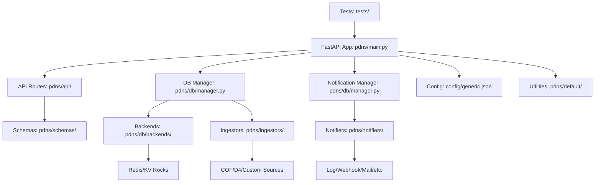

# Codebase Overview

This document provides an overview of the `analyzer-d4-passivedns` codebase, a FastAPI-based Passive DNS server compliant with the [Passive DNS - Common Output Format (draft-dulaunoy-dnsop-passive-dns-cof)](https://tools.ietf.org/html/draft-dulaunoy-dnsop-passive-dns-cof). It outlines the project structure, key modules, and their roles to help developers navigate and contribute effectively.

## Project Structure

The codebase is organized for modularity, with clear separation of concerns for API, database, ingestors, notifiers, and utilities. Key directories and files include:

- `pdns/`: Core Python package containing the application logic.
  - `main.py`: FastAPI application entry point.
  - `api/`: API routes and endpoint handlers.
  - `db/`: Database management and backend implementations.
  - `ingestors/`: Modular ingestors for data sources.
  - `notifiers/`: Modular notifiers for alerts.
  - `schemas/`: Pydantic models for API requests and responses.
  - `default/`: Shared utilities and helpers.
- `config/`: Configuration files (e.g., `generic.json`, `logging.json`).
- `bin/`: Scripts for ingestion and maintenance tasks.
- `tests/`: Unit and integration tests.
- `docs/`: MkDocs-based documentation.
- `tools/`: Utility scripts (e.g., `validate_config_files.py`, `3rdparty.py`).
- `etc/`: Database configuration files (e.g., `redis.conf`).
- `poetry.lock` / `pyproject.toml`: Dependency management with Poetry.

## Key Components

### FastAPI Application (`pdns/main.py`)

- Defines the FastAPI app, mounts routes, and sets up middleware.
- Uses `lifespan` events for initializing and cleaning up resources (e.g., database connections).
- Exposes endpoints like `/info`, `/query/{q}`, `/fquery/{q}`, and `/stream/{q}` via `pdns/api/`.
- Generates OpenAPI specs at `http://localhost:8000/docs`.

### API Routes (`pdns/api/`)

- Organized into modules (e.g., `query.py`, `info.py`).
- Uses FastAPI’s dependency injection for authentication and database access.
- Authentication is configured in `generic.json`:
  ```json
  {
    "auth": {
      "endpoints": {
        "query": {"auth": "bearer"}
      },
      "tokens": {
        "user": "xyz123"
      }
    }
  }
  ```

### Database Management (`pdns/db/`)

- `manager.py`: Contains `DBManager` for dynamic backend loading and `NotificationManager` for notifiers.
- `backends/`: Implementations for Redis (`redis.py`, `redis_json.py`) and KV Rocks (`kvrocks.py`).
- Configured in `generic.json`:
  ```json
  {
    "database": {
      "type": "redis",
      "config": {
        "host": "localhost",
        "port": 6379,
        "db": 0
      }
    }
  }
  ```

### Ingestors (`pdns/ingestors/`)

- Modular classes (e.g., `cof.py`, `d4.py`) for data ingestion from sources like COF websockets or D4 servers.
- Configured in `generic.json`:
  ```json
  {
    "ingestors": {
      "cof_ingestor": {
        "type": "cof",
        "config": {
          "websocket": "ws://crh.circl.lu:8888"
        }
      }
    }
  }
  ```
- Run via scripts in `bin/` (e.g., `pdns-import-cof.py`).

### Notifiers (`pdns/notifiers/`)

- Modular classes (e.g., `log/notifier.py`, `mail/notifier.py`) for sending alerts.
- Configured in `generic.json` or `pdns/notifiers/<name>/config.json`:
  ```json
  {
    "notifiers": {
      "log_alert": {
        "type": "log",
        "config": {
          "name": "log_alert",
          "condition": {"rrtype": "A"},
          "level": "info"
        }
      }
    }
  }
  ```
- Uses Jinja2 templates (`template.jinja`) for message formatting.
- No retries for failed notifications to minimize load.

### Schemas (`pdns/schemas/`)

- Pydantic models (e.g., `DNSRecord`, `InfoResponse`) for request/response validation.
- Ensures compliance with COF schema.

### Utilities (`pdns/default/`)

- `helpers.py`: Logging and configuration utilities.
- `exceptions.py`: Custom exceptions (e.g., `DBConnectionError`).

## Configuration

All configurations are managed via `generic.json`, including database, ingestors, notifiers, and authentication. Validate configs with:

```bash
python tools/validate_config_files.py --check
```

The `PDNS_HOME` environment variable must point to the project root:

```bash
export PDNS_HOME=/path/to/analyzer-d4-passivedns
```

## Testing

Tests in `tests/` use `pytest` and `pytest-asyncio` for unit and integration testing. Run tests with:

```bash
poetry run pytest --cov=pdns
```

## Mermaid Diagram: Codebase Architecture



## Getting Started

1. Clone the repository and set up the environment (see [Contributing](./contributing.md)).
2. Explore `pdns/main.py` to understand the FastAPI setup.
3. Review `generic.json` for configuration details.
4. Run the server:
   ```bash
   poetry run uvicorn pdns.main:app --host 0.0.0.0 --port 8000
   ```
5. Test endpoints at `http://localhost:8000/docs`.

## Contribution Tips

- **Modularity**: Add new ingestors or notifiers in their respective directories.
- **Async/Await**: Use async for I/O operations (e.g., database, HTTP).
- **Testing**: Write tests for new features in `tests/`.
- **Documentation**: Update `docs/` for new functionality.

For related guides, see:

- [Contributing](./contributing.md)
- [Testing](./testing.md)
- [Adding Ingestors](./adding-ingestors.md)
- [Adding Notifiers](./adding-notifiers.md)
- [API Development](./api-development.md)