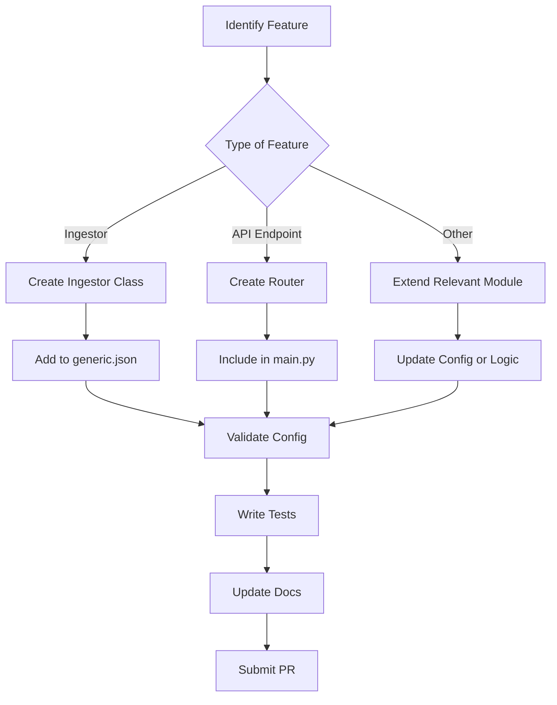

# Adding Features

This guide details how to extend `analyzer-d4-passivedns` by adding new ingestors, API endpoints, or other features. The project’s modular design, built on FastAPI, allows seamless integration of new functionality while maintaining compliance with the Passive DNS - Common Output Format (draft-dulaunoy-dnsop-passive-dns-cof).

## Adding a New Ingestor

Ingestors collect and process DNS data from various sources (e.g., D4 sensors, COF websockets). To add a new ingestor:

1. **Create the Ingestor Class**:

   - In `pdns/ingestors/`, create a new module, e.g., `custom_ingestor.py`.

   - Subclass `DaemonIngestor` and implement the `ingest` method:

     ```python
     from .base import DaemonIngestor
     from ..db.manager import DatabaseManager
     from pypdns import PDNSRecord
     
     class CustomIngestor(DaemonIngestor):
         type = "custom"
         def __init__(self, db: DatabaseManager, source: str):
             super().__init__(db)
             self.source = source
     
         async def ingest(self):
             # Example: Read data from a custom source
             data = await self.fetch_data(self.source)
             for item in data:
                 record = PDNSRecord(**item)
                 await self.db.store_record(record)
             logger.info({"event": "custom_ingestor_data_processed", "source": self.source})
     
         async def fetch_data(self, source: str):
             # Implement data fetching logic
             return [{"rrname": "example.com", "rrtype": "A", "rdata": "93.184.216.34"}]
     ```

2. **Configure the Ingestor**:

   - Update `config/generic.json` to include the new ingestor:

     ```json
     {
       "ingestors": {
         "custom_ingestor": {
           "type": "custom",
           "config": {
             "source": "https://example.com/dns-data"
           }
         }
       }
     }
     ```

   - Validate the configuration:

     ```bash
     python tools/validate_config_files.py --check
     ```

3. **Test the Ingestor**:

   - Add tests in `tests/test_ingestors/test_custom_ingestor.py`:

     ```python
     import pytest
     from pdns.ingestors.custom_ingestor import CustomIngestor
     from pdns.db.manager import DatabaseManager
     
     @pytest.mark.asyncio
     async def test_custom_ingestor():
         db = DatabaseManager()
         ingestor = CustomIngestor(db, source="test")
         await ingestor.ingest()
         # Add assertions for stored records
     ```

## Adding a New API Endpoint

To add a new API endpoint to the FastAPI application:

1. **Create a Router**:

   - In `pdns/routes/`, create a new module, e.g., `custom.py`:

     ```python
     from fastapi import APIRouter, Depends
     from ..db.manager import DatabaseManager
     from ..default.helpers import get_database
     
     router = APIRouter(prefix="/custom", tags=["custom"])
     
     @router.get("/")
     async def custom_endpoint(db: DatabaseManager = Depends(get_database)):
         stats = await db.get_stats()
         return {"message": "Custom endpoint", "stats": stats}
     ```

2. **Include the Router in** `main.py`:

   - Update `pdns/main.py` to include the new router:

     ```python
     from .routes import info, query, fquery, stream, custom
     # ...
     app.include_router(custom.router, dependencies=[Depends(optional_auth)])
     ```

3. **Update Authentication (Optional)**:

   - Configure authentication in `config/auth.json`:

     ```json
     {
       "endpoints": {
         "custom": {"auth": "bearer"}
       }
     }
     ```

4. **Document the Endpoint**:

   - Update `docs/user/api-reference.md` with the new endpoint details.
   - The endpoint will automatically appear in the OpenAPI spec at `http://localhost:8000/docs`.

## Adding Other Features

To add other features (e.g., new notifiers, database backends):

1. **Notifiers**:

   - Follow the guide in Adding Notifiers to create a new notifier in `pdns/notifiers/`.
   - Example: Add a Slack notifier with a webhook configuration.

2. **Database Backends**:

   - Extend `pdns/db/base.py` with a new `Database` subclass.

   - Update `pdns/db/manager.py` to support the new backend type in `generic.database.type`:

     ```python
     if db_type == "new_backend":
         self.database = NewBackendDatabase(**db_config_params)
     ```

3. **Configuration**:

   - Add new fields to `config/generic.json` and update `config/generic.json.sample`.
   - Run `tools/validate_config_files.py --update` to sync user configs.

## Mermaid Diagram: Feature Addition Workflow



## Best Practices

- **Modularity**: Ensure new features are self-contained and configurable via `generic.json`.
- **Testing**: Cover new functionality with unit and integration tests.
- **Documentation**: Update user, admin, and developer guides to reflect changes.
- **Performance**: Optimize for low system load, leveraging FastAPI’s async capabilities and Redis pipelining.

For more details, see:

- Adding Ingestors
- Adding Notifiers
- API Development