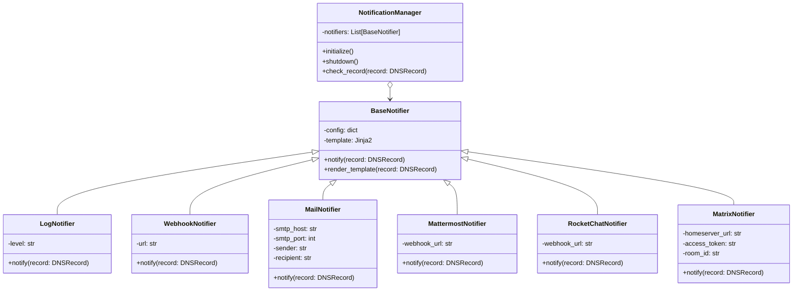

# Notifiers Documentation

The notifier system in `analyzer-d4-passivedns` triggers alerts based on DNS record conditions, enabling real-time monitoring of DNS events. Notifiers are modular, directory-based, and managed by the `NotificationManager`, which ensures efficient condition matching and notification delivery without retries for failed notifications.

## Structure

Each notifier resides in its own directory under `pdns/notifiers/<name>/`, containing:

- `notifier.py`: The Python class implementing the notifier logic.
- `config.json`: Configuration file specifying alert conditions and delivery settings (except for the `log` notifier, which uses `get_config`).
- `template.jinja`: Jinja2 template for formatting notification messages.

## Notifiers

### `log`

- **Description**: Logs alerts to the application logger, useful for debugging or monitoring.
- **Config**: Loaded via `get_config("notifiers").get("log")` from `config/notifiers.json`.
- **Fields**:
  - `name`: Unique alert name.
  - `condition`: Matching conditions for DNS records (e.g., `{"rrtype": "A"}`).
  - `level`: Log level (`debug`, `info`, `warning`, `error`, `critical`).
- **Example Config** (in `config/notifiers.json`):
  ```json
  {
    "notifiers": {
      "log": {
        "name": "log_alert",
        "condition": {"rrtype": "A"},
        "level": "info"
      }
    }
  }
  ```

### `webhook`

- **Description**: Sends alerts via HTTP POST to a specified webhook URL.
- **Config**: Located in `pdns/notifiers/webhook/config.json`.
- **Fields**:
  - `name`: Unique alert name.
  - `condition`: Matching conditions.
  - `url`: Webhook URL for POST requests.
- **Example**:
  ```json
  {
    "name": "webhook_alert",
    "condition": {"rrname": "example.com"},
    "url": "https://webhook.example.com/notify"
  }
  ```

### `mail`

- **Description**: Sends email alerts via SMTP.
- **Config**: Located in `pdns/notifiers/mail/config.json`.
- **Fields**:
  - `name`: Unique alert name.
  - `condition`: Matching conditions.
  - `smtp_host`: SMTP server host.
  - `smtp_port`: SMTP server port.
  - `sender`: Sender email address.
  - `recipient`: Recipient email address.
- **Example**:
  ```json
  {
    "name": "mail_alert",
    "condition": {"rdata": "in:10.0.0.0/24"},
    "smtp_host": "smtp.example.com",
    "smtp_port": 587,
    "sender": "alerts@example.com",
    "recipient": "admin@example.com"
  }
  ```

### `mattermost`

- **Description**: Posts alerts to a Mattermost webhook.
- **Config**: Located in `pdns/notifiers/mattermost/config.json`.
- **Fields**:
  - `name`: Unique alert name.
  - `condition`: Matching conditions.
  - `webhook_url`: Mattermost webhook URL.
- **Example**:
  ```json
  {
    "name": "mattermost_alert",
    "condition": {"rrtype": "A", "rdata": "regex:192\\.168\\..*"},
    "webhook_url": "https://mattermost.example.com/hooks/xyz123"
  }
  ```

### `rocketchat`

- **Description**: Posts alerts to a Rocket.Chat webhook.
- **Config**: Located in `pdns/notifiers/rocketchat/config.json`.
- **Fields**: Same as `mattermost`.
- **Example**:
  ```json
  {
    "name": "rocketchat_alert",
    "condition": {"rrname": "example.com"},
    "webhook_url": "https://rocketchat.example.com/hooks/abc456"
  }
  ```

### `matrix`

- **Description**: Sends alerts to a Matrix room.
- **Config**: Located in `pdns/notifiers/matrix/config.json`.
- **Fields**:
  - `name`: Unique alert name.
  - `condition`: Matching conditions.
  - `homeserver_url`: Matrix homeserver URL.
  - `access_token`: Matrix access token.
  - `room_id`: Matrix room ID.
- **Example**:
  ```json
  {
    "name": "matrix_alert",
    "condition": {"rdata": "in:10.0.0.0/24"},
    "homeserver_url": "https://matrix.org",
    "access_token": "syt_abc123...",
    "room_id": "!roomid:matrix.org"
  }
  ```

## Conditions

Conditions define when a notifier triggers based on DNS record attributes:

- **Exact Match**: `{"key": "value"}` (e.g., `{"rrname": "example.com"}`).
- **Regex**: `{"key": "regex:pattern"}` (e.g., `{"rdata": "regex:192\\.168\\..*"}`).
- **IP Network**: `{"key": "in:network"}` (e.g., `{"rdata": "in:10.0.0.0/24"}`).

Multiple conditions can be combined (e.g., `{"rrtype": "A", "rdata": "regex:192\\.168\\..*"}`).

## Triggering

The `NotificationManager` in `pdns/notifiers/manager.py`:
- Loads notifiers from `pdns/notifiers/` directories and `config/notifiers.json`.
- Matches DNS records against conditions during `store_record` in `DatabaseManager`.
- Sends notifications without retries to minimize system load, logging failures for debugging.

## Adding a New Notifier

To add a new notifier (e.g., a Slack notifier):

1. **Create the Notifier Directory**:

   - Create `pdns/notifiers/slack/`.

2. **Implement the Notifier Class**:

   - In `pdns/notifiers/slack/notifier.py`:

     ```python
     from .base import BaseNotifier
     from ..default.helpers import logger
     import aiohttp
     
     class SlackNotifier(BaseNotifier):
         def __init__(self, config: dict):
             super().__init__(config)
             self.webhook_url = config.get("webhook_url")
     
         async def notify(self, record: 'DNSRecord'):
             if not self.webhook_url:
                 logger.error({"event": "slack_notify_failed", "error": "Missing webhook_url"})
                 return
             message = self.render_template(record)
             async with aiohttp.ClientSession() as session:
                 try:
                     async with session.post(self.webhook_url, json={"text": message}) as resp:
                         if resp.status != 200:
                             logger.error({"event": "slack_notify_failed", "status": resp.status})
                 except Exception as e:
                     logger.error({"event": "slack_notify_failed", "error": str(e)})
     ```

3. **Create the Jinja2 Template**:

   - In `pdns/notifiers/slack/template.jinja`:

     ```
     New DNS record detected:
     RRName: {{ record.rrname }}
     RRType: {{ record.rrtype }}
     RData: {{ record.rdata }}
     ```

4. **Configure the Notifier**:

   - In `pdns/notifiers/slack/config.json`:

     ```json
     {
       "name": "slack_alert",
       "condition": {"rrtype": "A"},
       "webhook_url": "https://hooks.slack.com/services/xxx/yyy/zzz"
     }
     ```

5. **Test the Notifier**:

   - Add tests in `tests/test_notifiers/test_slack.py`:

     ```python
     import pytest
     from pdns.notifiers.slack.notifier import SlackNotifier
     from pdns.schemas import DNSRecord
     
     @pytest.mark.asyncio
     async def test_slack_notifier():
         config = {"name": "slack_alert", "condition": {"rrtype": "A"}, "webhook_url": "http://test"}
         notifier = SlackNotifier(config)
         record = DNSRecord(rrname="example.com", rrtype="A", rdata="93.184.216.34")
         await notifier.notify(record)
         # Assert notification sent or logged
     ```

## Mermaid Diagram: Notifier System



## Best Practices

- **No Retries**: Design notifiers to log failures rather than retry, ensuring low system load.
- **Condition Specificity**: Use precise conditions to avoid excessive notifications.
- **Template Flexibility**: Leverage Jinja2 for customizable message formats.
- **Security**: Secure sensitive config fields (e.g., `access_token`) in `config.json`.

For related guides, see:

- Adding Ingestors
- API Development
- Codebase Overview