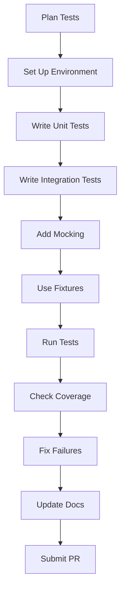

# Testing

This guide explains how to write, run, and maintain tests for the `analyzer-d4-passivedns` project, a FastAPI-based Passive DNS server compliant with the [Passive DNS - Common Output Format (draft-dulaunoy-dnsop-passive-dns-cof)](https://tools.ietf.org/html/draft-dulaunoy-dnsop-passive-dns-cof). Testing ensures the reliability of the API, ingestors, notifiers, and database interactions, using `pytest` for unit and integration tests.

## Overview

Tests are located in the `tests/` directory and organized by module (e.g., `tests/test_api/`, `tests/test_notifiers/`). The project uses:

- **pytest**: Test framework.
- **pytest-asyncio**: For async tests (e.g., FastAPI endpoints, notifiers).
- **pytest-cov**: For code coverage reporting.
- **unittest.mock**: For mocking dependencies (e.g., database, HTTP clients).
- **Test Dependencies**: Installed via Poetry with the `dev` group (e.g., `pytest`, `httpx`).

## Setting Up the Test Environment

1. **Install Dependencies**:

   ```bash
   poetry install --with dev
   ```

2. **Set Up the Database**:

   - **Redis**:
     ```bash
     ./bin/install_server_redis.sh
     ./redis/src/redis-server ./etc/redis.conf
     ```
     Verify:
     ```bash
     redis-cli -p 6379 ping
     ```

   - **KV Rocks**:
     ```bash
     ./bin/install_server_kvrocks.sh
     ./kvrocks/src/kvrocks -c ./etc/kvrocks.conf
     ```
     Verify:
     ```bash
     ./kvrocks/src/kvrocks-cli -p 6666 PING
     ```

3. **Configure the Environment**:

   - Copy the sample configuration:
     ```bash
     cp config/generic.json.sample config/generic.json
     ```
   - Edit `config/generic.json` for testing:
     ```json
     {
       "database": {
         "type": "redis",
         "config": {
           "host": "localhost",
           "port": 6379,
           "db": 0
         }
       },
       "rrset_supported": ["A", "AAAA"],
       "excludesubstrings": [],
       "expiration": { "A": 86400, "AAAA": 86400 },
       "ingestors": {},
       "notifiers": {
         "test_log": {
           "type": "log",
           "config": {
             "name": "test_log",
             "condition": {"rrtype": "A"},
             "level": "debug"
           }
         }
       }
     }
     ```

   - Set `PDNS_HOME`:
     ```bash
     export PDNS_HOME=$(pwd)
     ```

## Running Tests

1. **Run All Tests**:

   ```bash
   poetry run pytest
   ```

2. **Run Specific Tests**:

   - By module:
     ```bash
     poetry run pytest tests/test_api/
     ```
   - By file:
     ```bash
     poetry run pytest tests/test_api/test_query.py
     ```

3. **Check Code Coverage**:

   ```bash
   poetry run pytest --cov=pdns --cov-report=html
   ```

   - View the coverage report in `htmlcov/index.html`.

4. **Run Async Tests**:

   - Ensure `@pytest.mark.asyncio` is used for async functions:
     ```bash
     poetry run pytest --asyncio-mode=auto
     ```

## Writing Tests

### Unit Tests

Test individual components (e.g., notifier logic, schema validation).

- **Example**: Testing a custom notifier (`tests/test_notifiers/test_custom.py`):
  ```python
  import pytest
  from pdns.notifiers.custom.notifier import CustomNotifier
  from pdns.schemas import DNSRecord
  
  @pytest.mark.asyncio
  async def test_custom_notifier():
      notifier = CustomNotifier(config={"name": "custom_alert", "condition": {"rrtype": "A"}})
      record = DNSRecord(
          rrname="example.com",
          rrtype="A",
          rdata="93.184.216.34",
          time_first=1698777600,
          time_last=1698777600,
          count=1,
          sensor_id="sensor1"
      )
      await notifier.notify(record)
      # Assert log output or mock external call
  ```

### Integration Tests

Test interactions between components (e.g., API endpoints, database).

- **Example**: Testing the `/query` endpoint (`tests/test_api/test_query.py`):
  ```python
  from fastapi.testclient import TestClient
  from pdns.main import app
  
  client = TestClient(app)
  
  def test_query_endpoint():
      response = client.get("/query/example.com", params={"format": "json"})
      assert response.status_code == 200
      assert isinstance(response.json(), list)
      # Add specific record assertions
  ```

### Mocking

Use `unittest.mock` to isolate dependencies (e.g., database, HTTP clients).

- **Example**: Mocking a database call:
  ```python
  from unittest.mock import AsyncMock, patch
  
  @pytest.mark.asyncio
  async def test_db_manager():
      with patch("pdns.db.manager.aioredis.Redis", new=AsyncMock()) as mock_redis:
          # Test database logic
          assert mock_redis.called
  ```

## Best Practices

- **Test Coverage**: Aim for 100% coverage of new code:
  ```bash
  poetry run pytest --cov=pdns
  ```
- **Async Testing**: Use `@pytest.mark.asyncio` for async functions (e.g., notifier `notify`, API routes).
- **Isolation**: Mock external services (e.g., Redis, webhooks) to avoid test dependencies.
- **Fixtures**: Use pytest fixtures for reusable test data:
  ```python
  @pytest.fixture
  def sample_record():
      return DNSRecord(
          rrname="example.com",
          rrtype="A",
          rdata="93.184.216.34",
          time_first=1698777600,
          time_last=1698777600,
          count=1
      )
  ```
- **Configuration**: Use a test-specific `generic.json` to avoid affecting production configs.
- **Documentation**: Update `testing.md` if new test strategies or tools are introduced.

## Mermaid Diagram: Testing Workflow



## Common Test Areas

- **API Endpoints**: Test `/info`, `/query`, `/fquery`, `/stream` for correct responses and error handling.
- **Notifiers**: Test `notify` methods for success and failure cases.
- **Ingestors**: Test data parsing and storage logic.
- **Database**: Test dynamic backend loading (Redis, KV Rocks) and record CRUD operations.
- **Schemas**: Validate Pydantic models for `DNSRecord` and API responses.

For related guides, see:

- [Contributing](./contributing.md)
- [Codebase Overview](./codebase-overview.md)
- [Adding Ingestors](./adding-ingestors.md)
- [Adding Notifiers](./adding-notifiers.md)
- [API Development](./api-development.md)