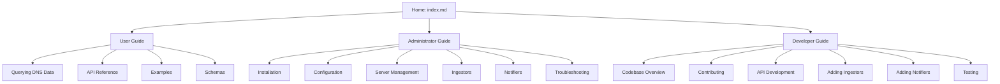

# Welcome to Analyzer D4 Passive DNS

The `analyzer-d4-passivedns` project is a FastAPI-based Passive DNS server compliant with the [Passive DNS - Common Output Format (draft-dulaunoy-dnsop-passive-dns-cof)](https://tools.ietf.org/html/draft-dulaunoy-dnsop-passive-dns-cof). It collects, stores, and queries DNS data from various sources, enabling researchers, security analysts, and network administrators to analyze domain and IP relationships. Built with modularity and scalability in mind, it supports dynamic database backends (Redis, KV Rocks), modular ingestors, and configurable notifiers.

This documentation provides comprehensive guides for users, administrators, and developers. Whether you’re querying DNS data, managing the server, or contributing to the codebase, you’ll find the resources you need below.

## Key Features

- **FastAPI-Powered API**: Exposes endpoints (`/info`, `/query`, `/fquery`, `/stream`) with auto-generated OpenAPI specs at `/docs`.
- **Modular Design**: Supports plug-and-play ingestors (e.g., COF, D4) and notifiers (e.g., log, mail, webhook).
- **Dynamic Backends**: Configurable database support for Redis or KV Rocks via `generic.json`.
- **COF Compliance**: Ensures interoperability with other Passive DNS systems.
- **Scalability**: Handles high-volume data with rate limiting, expiration policies, and load balancing.

## Quickstart

1. **Install the Server**:
   ```bash
   git clone https://github.com/D4-project/analyzer-d4-passivedns.git
   cd analyzer-d4-passivedns
   poetry install
   ```

2. **Set Up Redis**:
   ```bash
   ./bin/install_server_redis.sh
   ./redis/src/redis-server ./etc/redis.conf
   ```

3. **Configure**:
   ```bash
   export PDNS_HOME=$(pwd)
   cp config/generic.json.sample config/generic.json
   ```

4. **Run the Server**:
   ```bash
   poetry run uvicorn pdns.main:app --host 0.0.0.0 --port 8000
   ```

5. **Query the API**:
   ```bash
   curl -H "Authorization: Bearer xyz123" "http://localhost:8000/query/example.com"
   ```

See [Installation](admin/installation.md) and [Querying DNS Data](user/querying-dns.md) for detailed instructions.

## Documentation Sections

- **User Guide**: Learn how to query DNS data using the API.
  - [Querying DNS Data](user/querying-dns.md)
  - [API Reference](user/api-reference.md)
  - [Examples](user/examples.md)
  - [Schemas](user/schemas.md)
- **Administrator Guide**: Set up, configure, and manage the server.
  - [Installation](admin/installation.md)
  - [Configuration](admin/configuration.md)
  - [Server Management](admin/management.md)
  - [Ingestors](admin/ingestors.md)
  - [Notifiers](admin/notifiers.md)
  - [Troubleshooting](admin/troubleshooting.md)
- **Developer Guide**: Contribute to the codebase and extend functionality.
  - [Codebase Overview](dev/codebase-overview.md)
  - [Contributing](dev/contributing.md)
  - [API Development](dev/api-development.md)
  - [Adding Ingestors](dev/adding-ingestors.md)
  - [Adding Notifiers](dev/adding-notifiers.md)
  - [Testing](dev/testing.md)

## Mermaid Diagram: Documentation Structure



## Getting Help

- **Issues**: Report bugs or request features on the [GitHub repository](https://github.com/D4-project/analyzer-d4-passivedns/issues).
- **Community**: Join the D4 Project community for support and discussions.
- **Documentation**: Explore the guides above or check the OpenAPI spec at `http://localhost:8000/docs`.

Start exploring the documentation to query DNS data, manage the server, or contribute to the project!