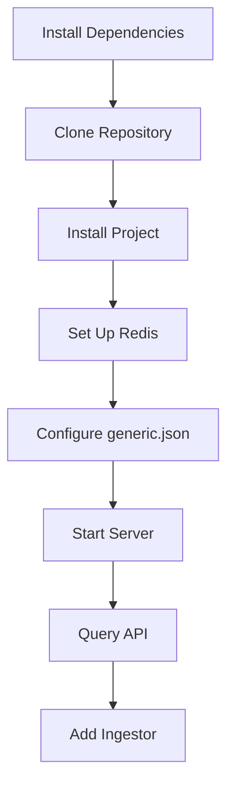

# Quickstart Guide

This guide helps you quickly set up and query the `analyzer-d4-passivedns` server, a FastAPI-based Passive DNS server compliant with the [Passive DNS - Common Output Format (draft-dulaunoy-dnsop-passive-dns-cof)](https://tools.ietf.org/html/draft-dulaunoy-dnsop-passive-dns-cof). In just a few minutes, you’ll have the server running and be able to query DNS data.

## Prerequisites

- **Operating System**: Linux (e.g., Ubuntu 20.04+).
- **Tools**: `git`, `curl`, Python 3.8+, and a terminal.
- **Permissions**: Ability to install packages (e.g., `sudo` access).

## Step 1: Install Dependencies

Install system packages and Poetry for Python dependency management:

```bash
sudo apt update
sudo apt install -y python3 python3-pip git
curl -sSL https://install.python-poetry.org | python3 -
export PATH="$HOME/.local/bin:$PATH"
```

## Step 2: Clone and Install the Project

Clone the repository and install dependencies:

```bash
git clone https://github.com/D4-project/analyzer-d4-passivedns.git
cd analyzer-d4-passivedns
poetry install
```

## Step 3: Set Up Redis

Install and start Redis as the database backend:

```bash
./bin/install_server_redis.sh
./redis/src/redis-server ./etc/redis.conf &
```

Verify Redis is running:

```bash
redis-cli -p 6379 ping
```

Expected output: `PONG`

## Step 4: Configure the Server

Set the environment variable and create a basic configuration:

```bash
export PDNS_HOME=$(pwd)
cp config/generic.json.sample config/generic.json
```

Edit `config/generic.json` to ensure Redis is configured:

```json
{
  "database": {
    "type": "redis",
    "config": {
      "host": "localhost",
      "port": 6379,
      "db": 0
    }
  },
  "rrset_supported": ["A", "AAAA", "CNAME"],
  "auth": {
    "endpoints": {
      "query": {"auth": "bearer"},
      "fquery": {"auth": "bearer"},
      "stream": {"auth": "bearer"},
      "info": {"auth": "none"}
    },
    "tokens": [
      {"name": "user", "value": "xyz123"}
    ]
  }
}
```

## Step 5: Start the Server

Run the FastAPI server:

```bash
poetry run uvicorn pdns.main:app --host 0.0.0.0 --port 8000 &
```

Verify the server is running:

```bash
curl http://localhost:8000/info
```

Expected response:

```json
{
  "version": "1.0.0",
  "software": "analyzer-d4-passivedns",
  "stats": {
    "total_records": 0
  },
  "sensors": []
}
```

## Step 6: Query the API

Query DNS records for `example.com`:

```bash
curl -H "Authorization: Bearer xyz123" "http://localhost:8000/query/example.com?limit=10"
```

Expected response (assuming data is ingested):

```json
[
  {
    "rrname": "example.com",
    "rrtype": "A",
    "rdata": "93.184.216.34",
    "time_first": 1698777600,
    "time_last": 1698777600,
    "count": 1,
    "sensor_id": "sensor1"
  }
]
```

## Step 7: Add an Ingestor (Optional)

To populate the database, start a COF ingestor:

```bash
poetry run pdns ingest --websocket ws://crh.circl.lu:8888 &
```

Add it to `config/generic.json`:

```json
{
  "ingestors": {
    "cof_ingestor": {
      "type": "cof",
      "config": {
        "websocket": "ws://crh.circl.lu:8888",
        "frequency": "realtime"
      }
    }
  }
}
```

## Troubleshooting

- **Server Not Starting**:
  - Check logs: `tail -f pdns.log | grep "ERROR"`
  - Ensure Redis is running: `redis-cli -p 6379 ping`
- **401 Unauthorized**:
  - Verify token (`xyz123`) in `generic.json`.
- **No Data Returned**:
  - Ensure an ingestor is running to populate the database.

See [Troubleshooting](../admin/troubleshooting.md) for more help.

## Mermaid Diagram: Quickstart Workflow



## Next Steps

- Explore the API: See [API Reference](./api-reference.md) and [Examples](./examples.md).
- Configure ingestors and notifiers: See [Configuration](../admin/configuration.md).
- Deploy for production: See [Deployment](../admin/deployment.md).

For a detailed setup, see [Installation](../admin/installation.md).